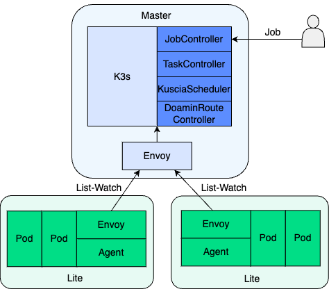
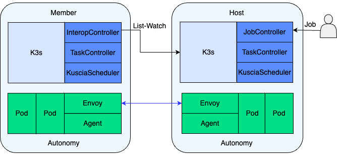

# SecretPad

[](https://www.apache.org/licenses/LICENSE-2.0.html)
<p align="center">
<a href="./README.zh-CN.md">简体中文</a>｜<a href="./README.md">English</a>
</p>

SecretPad (official site: [secretflow.org.cn](https://www.secretflow.org.cn/zh-CN/docs/secretpad/))
is a **privacy-preserving computing** web platform based on
the [Kuscia](https://www.secretflow.org.cn/zh-CN/docs/kuscia/)
framework, designed to provide easy access to privacy-preserving data intelligence and machine learning functions. With
SecretPad:

* You can create node, register data, create project, create authorization between cooperative nodes.
* You can use the ability of data preprocessing, analysis and modeling to meet diverse business scenarios
* You can use the ability of model training and model prediction.

## Secretpad-frontend

* [secretpad-frontend](https://github.com/secretflow/secretpad-frontend)
  is a frontend project of SecretPad, and you can use ```make build``` to deploy frontend code in a SecretPad project

```text
secretpad
├──secretpad-web
│  ├─src/main/resource
```

## NetworkMode

Two networking modes are supported: master networking mode and p2p networking mode.

#### master

In the master networking mode, multiple nodes share a control plane, and the control plane is responsible for
managing the resources and task scheduling of multiple nodes. Nodes in this mode have fewer resources and are called
Lite nodes.
The master networking mode is suitable for node interconnection within large organizations, and through a unified
control plane, it can significantly reduce O&M and resource costs, and facilitate the rapid addition of nodes.


#### P2P

In peer-to-peer (P2P) networking, nodes have independent control planes, and node instances and control planes are in
the same subnet
Autonomy node. In this mode, the party uses the InterConn Controller to synchronize pods from the scheduler to the
cluster, and binds the scheduler to the node instance.
The point-to-point networking mode is suitable for small organizations or scenarios with high security requirements.


## Quick Start

It is super easy to get started with your first project.

### Start by the provided startup package

#### Step 1: Download the mvp all in one package

You can download the package from the [latest mvp allInOnePackage](https://www.secretflow.org.cn/zh-CN/deployment).

Take mvp package `secretflow-allinone-package-latest.tar.gz` for example:

```sh
tar -xzf secretflow-allinone-package-latest.tar.gz
cd secretflow-allinone-package-latest
```

#### Step 2: Start Server

On the **Linux/Unix/Windows/Mac(inter)** platform(requires docker), run the following command to start
server :

```sh
# Start with master mode contains alice and bob lite
sh install.sh master
```

```sh
# deploy lite node there must be a master node
sh install.sh lite -n domainId -t token -p 30002 -m master endpoint -s 8089 -k 40812 -g 40813 -q 23801
```

```sh
# deploy autonomy node
sh install.sh p2p -n domainId  -s 8099 -g 8092 -k 8091 -p 8090 -q 33801
```

```sh
# deploy autonomy-node for multi-node in p2p mode
sh install.sh autonomy-node -n domainId -g 8096 -k 8087 -p 8088 -P notls -q 13805 -m 'http://secretpad:port' -t "token for node register on pad"  -x 13086
```

For more details, see [Development](./docs/deployment_experience/v0.6.0b0/deploy_secretpad.md)

## Versions

> Most of the time, the secretpad version will be smaller than the kuscia version<br>
> You can use the version in the following table as the docker image tag to pull the image<br>
> See all available tags by [hub.docker](https://hub.docker.com/r/secretflow/secretflow-lite-anolis8/tags)<br>
> or use alibaba cloud image service <br>
> > secretflow-registry.cn-hangzhou.cr.aliyuncs.com/secretflow/secretpad<br>
> > secretflow-registry.cn-hangzhou.cr.aliyuncs.com/secretflow/kuscia<br>
> > secretflow-registry.cn-hangzhou.cr.aliyuncs.com/secretflow/secretflow-lite-anolis8<br>
> > secretflow-registry.cn-hangzhou.cr.aliyuncs.com/secretflow/serving-anolis8<br>

| secretpad Version | Kuscia Version | secretflow Version | trustedflow Version | serving Version | dataproxy Version | scql Version |
|-------------------|----------------|--------------------|---------------------|-----------------|-------------------|--------------|
| 0.12.0b0          | 0.13.0b0       | 1.11.0b1           | 0.1.1b0             | 0.8.0b0         | 0.3.0b0           | 0.9.2b1      |
| 0.11.0b0          | 0.12.0b0       | 1.10.0b0/1.10.0b1  | 0.1.1b0             | 0.7.0b0         | 0.2.0b0           |              |
| 0.10.0b0/0.10.1b0 | 0.11.0b0       | 1.9.0b0/1.9.0b2    | 0.1.1b0             | 0.6.0b0         | 0.1.0b1           |              |
| 0.9.0b0           | 0.10.0b0       | 1.8.0b0            | 0.1.1b0             | 0.5.0b0         |                   |              |
| 0.8.0b0/0.8.1b0   | 0.9.0b0        | 1.7.0b0            | 0.1.1b0             | 0.4.0b0         |                   |              |
| 0.7.1b0/0.7.2b0   | 0.8.0b0        | 1.6.1b0            | 0.1.1b0             | 0.3.1b0         |                   |              |
| 0.6.0b0           | 0.7.0b0        | 1.5.0b0            | 0.1.1b0             | 0.2.1b0         |                   |              |
| 0.5.0b0           | 0.6.0b0        | 1.4.0b0            | 0.1.1b0             | 0.2.0b0         |                   |              |
| 0.4.1b0           | 0.5.0b0        | 1.4.0.dev24011601  | 0.1.1b0             |                 |                   |              |
| 0.3.0b0           | 0.4.0b0        | 1.3.0.dev20231109  | 0.1.1b0             |                 |                   |              |

## Contact

* [bilibili](https://space.bilibili.com/2073575923): secretflow bilibili account
* technical support WeChat: secretflow02
* WeChat Official Accounts: 隐语的小剧场
* WeChat group: SecretFlow01

## Disclaimer

Non-release version of SecretPad is only for demonstration and should not be used in production environments.
Although this version of SecretPad covers the basic abilities, there may be some security issues and functional defects
due to insufficient functionality and unfinished items in the project.
We welcome your active suggestions and look forward to the official release.