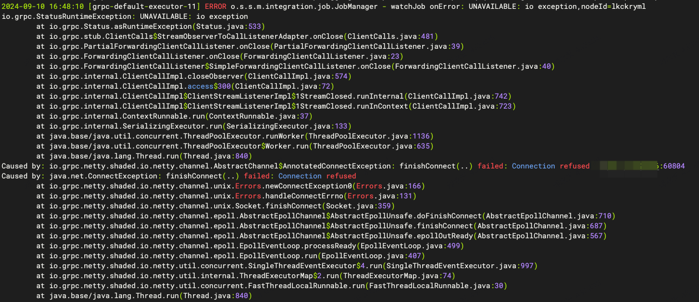
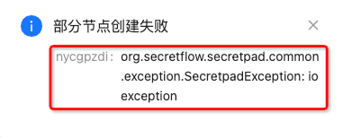

# 点对点模式多节点下数据源数据表相关问题&解决方案
> 在p2p模式中，可以批量为本机构下多个节点注册数据源和数据表，平台允许出现部分节点注册失败

## 数据源
>选择多个节点批量创建数据源，只要有一个节点创建成功，整个创建数据源的动作都是成功的。

创建数据源成功的节点会展示在数据源列表状态位置，如下图：


当部分节点创建失败会出现弹窗，红色框内为失败的节点id与具体失败原因，如下图：


## 创建数据源失败原因
> 如果弹窗给出的失败原因不足以定位问题，可以查看日志详情，具体步骤如下：

```shell
# 进入 secretpad.log 所在目录 alice是部署脚本-n参数
cd /root/kuscia/autonomy/secretpad/alice/log
```

```shell
# 查看 secretpad.log 日志
tail -fn 3000 secretpad.log
```

## 数据源创建失败解决方案

### kuscia 容器暂停服务



>进入日志中如果看到下面图片所展示异常信息，即为`lkckryml`节点的 kuscia 容器暂停服务，可以尝试重启`lkckryml`节点的 kuscia 容器

```shell
# 查找已暂停的 kuscia 容器
docker ps -a
```
```shell
# 重启 kuscia 容器
docker restart root-kuscia-autonomy-lkckryml
```

执行完命令之后的等待两分钟，在页面查看容器是否重启成功，重启成功重新选择该节点创建数据源即可。

>tip: 如果重启之后只选择该节点创建数据源，此时创建的数据源跟之前创建的不是同一个，是一个全新的数据源。

## 数据表
>选择多个节点批量创建数据表，只要有一个节点创建成功，整个创建数据表的动作都是成功的。

创建数据表成功的节点会展示在数据表列表中，如下图：


当部分节点创建失败会出现弹窗，红色框内为失败的节点id与具体失败原因，如下图：



## 创建数据表失败原因
> 如果弹窗给出的失败原因不足以定位问题，可以查看日志详情，具体步骤如下：

```shell
# 进入 secretpad.log 所在目录 alice是部署脚本-n参数
cd /root/kuscia/autonomy/secretpad/alice/log
```

```shell
# 查看 secretpad.log 日志
tail -fn 3000 secretpad.log
```

## 数据表创建失败解决方案

### kuscia 容器暂停服务


>进入日志中如果看到下面图片所展示异常信息，即为`lkckryml`节点的 kuscia 容器暂停服务，可以尝试重启`lkckryml`节点的 kuscia 容器

```shell
# 查找已暂停的 kuscia 容器
docker ps -a
```
```shell
# 重启 kuscia 容器
docker restart root-kuscia-autonomy-lkckryml
```

执行完命令之后的等待两分钟，在页面查看容器是否重启成功，重启成功重新选择该节点创建数据表即可。

>tip: 数据源与数据表不同，同时给多个节点创建数据表，本身每张表的id都不相同，相互独立，因此重启成功后直接选择该节点创建数据表即可。
