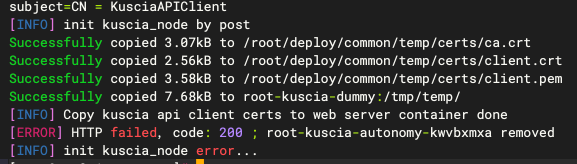
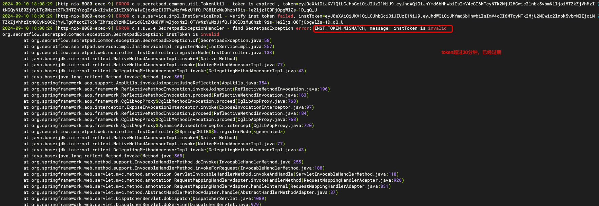
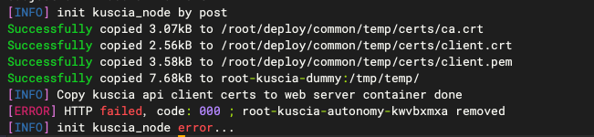
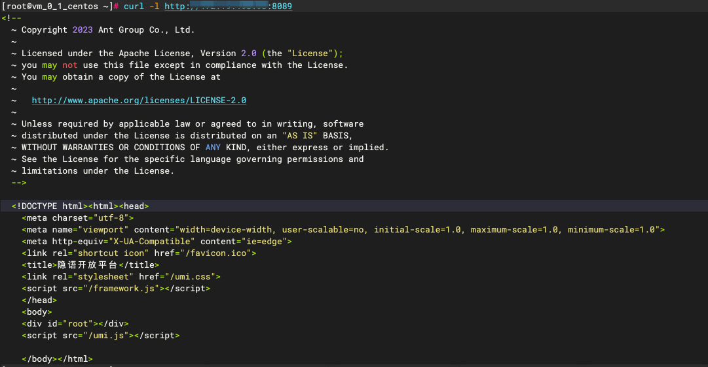

# 点对点模式多节点部署相关问题

## 1. token不匹配或超时（-t）
部署时-t参数不匹配或者token过期（30分钟过期）,会出现如下问题：



> 如果部署日志不足以定位问题，可以查看日志详情，具体步骤如下：

```shell
# 进入 secretpad.log 所在目录 alice是部署脚本-n参数
cd /root/kuscia/autonomy/secretpad/alice/log
```

```shell
# 查看 secretpad.log 日志
tail -fn 3000 secretpad.log
```
### 1.1 token不匹配

出现下面问题代表token出错，遇见该问题重新到节点中心刷新token，复制新token重新部署即可。


### 1.2 token过期

出现该问题，表示token已经超时，此时需要到节点中心刷新token，复制新token进行部署即可。




## 2. 请求地址错误（-m）
部署时-m参数不正确,会出现如下问题：



出现`code：000`问题表示`-m`参数出错，可以看日志是否有异常信息，如果日志什么也没输出，可以尝试curl来判断一下是否是网络问题。
```shell
# 执行 curl 命令 curl -l `-m参数`
curl -l http://xxxx:8080
```
执行curl命令，如果控制台无输出代码网络出现问题。

执行curl命令，如果控制台出现下面内容，代表网络没有问题，可再尝试部署

