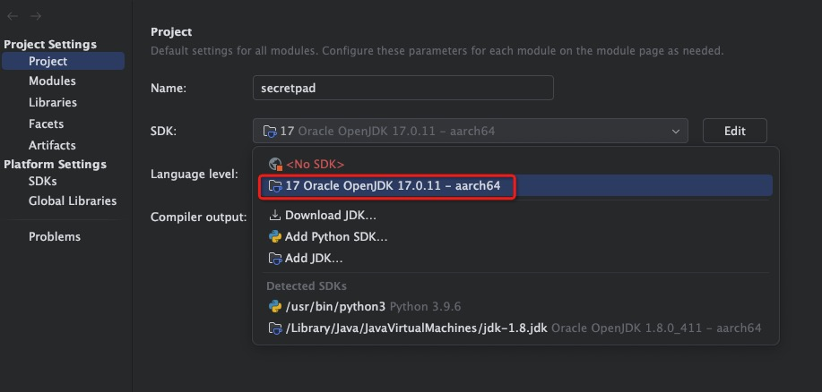
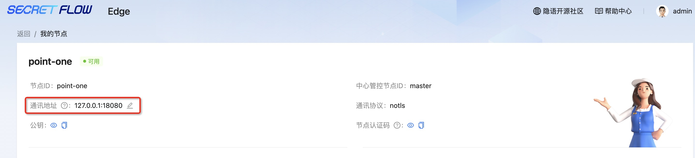
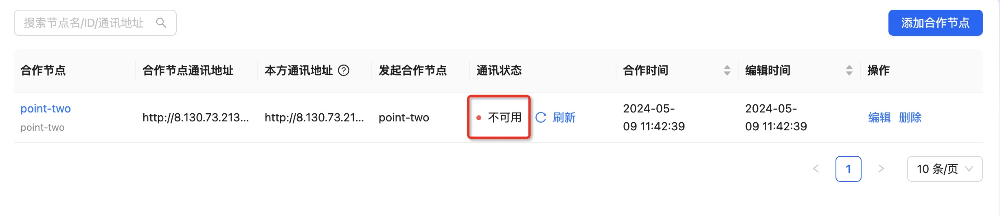

# 常见问题

## 安装类问题

### notls/mtls/tls 的区别

* notls: 此模式下，通信通过未加密的 HTTP 传输，比较安全的内部网络环境或者 Kuscia 已经存在外部网关的情况可以使用该模式【直接部署在公网有安全风险】。
* tls: (默认)在此模式下，通信通过 TLS 协议进行加密，即使用 HTTPS 进行安全传输，不需要手动配置证书。
* mtls: 这种模式也使用 HTTPS 进行通信，但它支持双向 TLS 验证，需要手动交换证书以建立安全连接。

### -s -k -g -p 等参数含义

* -n：节点名称，平台页面的计算节点ID。
* -m：master节点地址。
    * 协议：与 —P 参数对应关系，notls->http、tls/mtls->https。
    * ip：master节点的 ip 地址。
    * port：master 节点的 gateway 端口号。
* -t：节点 token，平台页面中的节点部署令牌。
* -d：项目的安装目录(默认安装目录是：$HOME/kuscia)。
* -p：参数传递的是 lite/autonomy 容器 kuscia-gateway 映射到主机的端口，保证和主机上现有的端口不冲突即可。
* -k：参数传递的是 lite/autonomy 容器 Kuscia-api 映射到主机的 HTTP/HTTPS 端口，保证和主机上现有的端口不冲突即可。
* -g：参数传递的是 lite/autonomy 容器 Kuscia-grpc 映射到主机的 HTTP/HTTPS 端口，保证和主机上现有的端口不冲突即可。
* -s： Secretpad 平台端口，保证和主机上现有的端口不冲突即可。
* -q：参数传递的是 lite/autonomy 容器 Kuccia 映射到主机的 env 端口，保证和主机上现有的端口不冲突即可。
* -P：KusciaAPI 以及节点对外网关使用的通信协议，有三种安全模式可供选择：notls/tls/mtls（非必填，只允许小写，默认： tls )。

详细命令参数说明可参考：[install.sh](../deployment/guide.md#installsh参数详解)

## 开发类问题

### 代码飘红/依赖找不到/编译不通过
#### 1.检查当前安装 JDK 版本是否 17

JDK版本查看
```shell
java --version

java 17.0.11 2024-04-16 LTS
Java(TM) SE Runtime Environment (build 17.0.11+7-LTS-207)
Java HotSpot(TM) 64-Bit Server VM (build 17.0.11+7-LTS-207, mixed mode, sharing)
```
如果安装了多个不同版本的jdk，请检查idea中设置的jdk版本是否正确




#### 2.检查依赖编译项目
```shell
mvn clean install -Dmaven.test.skip=true
```
本地开发请参考：[secretpad本地调试](../development/ru_in_idea_cn.md)

### 查看用到的组件版本

在 Secretpad 项目根目录下 config 目录中可以查看用到的组件版本

```shell
cd 项目根目录/config/components/

cat secretflow.json
```

## 使用类问题

### p2p 节点模式下节点无法通讯

#### 检查本方以及对方的通讯地址


节点信息里修改下 ip ，使用本机的 ip ，不要用127.0.0.1，如在公有云部署请使用公网ip。

#### 检查本方以及对方的通讯端口

如果本方启动脚本及参数如下：
```shell
bash install.sh autonomy -n point-one -s 8080 -g 40803 -k 40802 -p 18080 -q 13081 -P notls
```
详细命令参数说明可参考：[install.sh](../deployment/guide.md#installsh参数详解)

则本方通信端口即为 -p 参数：18080

### 运行隐私求交时卡死

#### 检查机器配置

若机器不满足[部署要求](../deployment/request.md)配置，可能会造成部分服务无法正常工作，从而导致作业运行失败。

#### 检查双方通讯状态是否正常


如果为不可用状态请参考[p2p节点模式下节点无法通讯](./qa.md#p2p节点模式下节点无法通讯)或[操作文档](../operation/p2p.md)

#### 检查样本数据是否正常
一份正常的样本数据应为：
```csv
name,age,country,address
bob,32,china,shanxi
```
如多“,”或少“,”可能会导致任务卡死

#### 检查cpu负载是否正常

docker stats 显示容器资源的使用情况

```shell
docker stats

CONTAINER ID   NAME                                       CPU %     MEM USAGE / LIMIT   MEM %     NET I/O         BLOCK I/O        PIDS
052c8e265054   root-kuscia-autonomy-secretpad-point-one   0.23%     3.721GiB / 4GiB     93.04%    245kB / 804kB   0B / 512kB       87
02ce5daac7a3   root-kuscia-autonomy-point-one             4.24%     2.299GiB / 4GiB     57.48%    126kB / 182kB   152kB / 2.44GB   106
```
如果 Docker 容器的 CPU 使用率过高或者超过100%，因为它的计算方式是所有容器内核线程的累积。一个单核的 CPU 可以有多个线程，每个线程都被分配了 CPU 时间。当一个容器内运行多个线程时，或者容器分配到的 CPU 资源超过了实际核心数，就可能发生这种情况。

解决方法：
* 检查容器内运行的应用是否设计合理，是否可以优化以减少 CPU 使用。
* 如果容器内有多个进程，请考虑减少同时运行的进程数，或者在运行新进程时先暂停一些不重要的进程。
* 检查容器的 CPU 资源限制。可以通过 docker update命 令来调整CPU的使用上限。
* 如果是多核心系统，请检查是否分配了过多的核心给容器，可以通过 docker update --cpus 来调整。
* 如果是短期内的峰值，可以考虑重启容器来平滑使用率。
* 如果是长期需求，可能需要优化应用代码或者结构，或者考虑使用更强大的硬件资源。

### 如何集成使用模型预测

* 参考：[集成说明](https://www.secretflow.org.cn/zh-CN/docs/secretpad-all-in-one/latest/gtif7u0il8atxwlo)
* 参考：[创建说明](https://www.secretflow.org.cn/zh-CN/docs/kuscia/v0.7.0b0/tutorial/run_sf_serving_with_api_cn#id5)
* 参考：[接口文档](https://www.secretflow.org.cn/zh-CN/docs/serving/)


若在部署过程中有相关的问题或建议，可提交[Issues](https://github.com/secretflow/secretpad/issues)反馈。