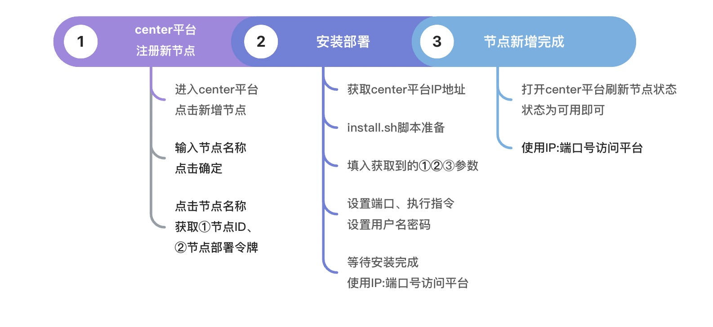
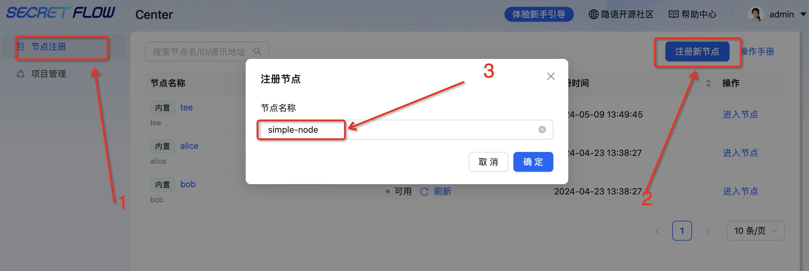
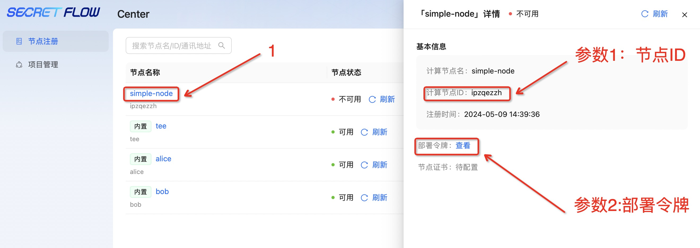
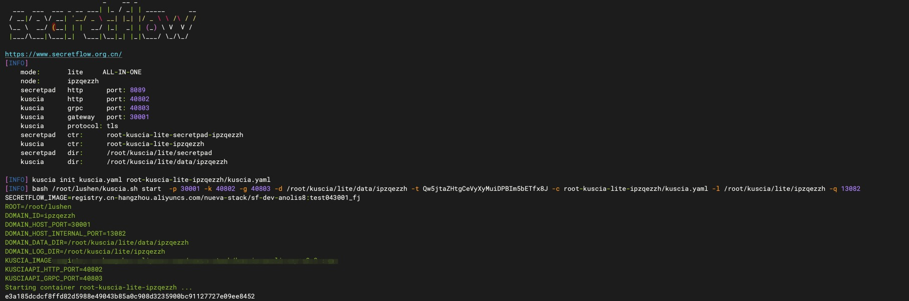

# Edge节点部署

## 环境准备

请参考：[部署要求](./request.md)

## 部署流程


## 第1步：节点注册、获取节点 ID 、获取节点令牌


* 点击菜单栏“节点注册”
* 点击右上角“注册新节点”
* 填入节点名称，点击“确定”


* 点击节点名称获取 ① 节点名称、 ② 节点令牌

## 第2步：安装部署
若是同一网络内，则只需获取本机的 ip 地址即可，以 mac 为例，通过 ifconfig 命令获取③ip地址。
若是跨网部署，则需要运维人员生成外网IP。

部署包和 Secretpad 的部署包是同一个，所以直接下载解压 Secretpad 的部署包即可。参考[前置准备](./guide.md#前置准备)。

```shell
# 进入install.sh所在目录
cd 进入install.sh所在目录

# ./install.sh lite -n ①平台的节点id -m 'https://③master的IP:18080' -t ②页面token -p ④kuscia Lite 节点的 gateway 端口 -s ⑤secretpad edge 侧 web 端口 -k ⑥kuscia Lite 节点 API HTTP 端口 -g ⑦uscia Lite 节点 API GRPC 端口
bash install.sh lite -n ipzqezzh -m 'https://172.19.190.99:18080' -t Qw5jtaZHtgCeVyXyMuiDPBIm5bETfx8J -p 30001 -s 8089 -k 40802 -g 40803 -q 13082
```
命令参数可以参考[install.sh参数说明](./guide.md#installsh参数详解)




## 第3步：设置登录web页面的用户名和密码
用户名长度要求大于 4 位字符 ，密码不低于 8 位字符。需包含大小写及数字。


## 第4步：安装完成
看到 “web server started successfully” 则代表部署成功


## 第5步：部署验证
请参考部署文档[验证部署](./guide.md#验证部署)

## 第6步：操作体验
请参考edge[操作文档](../operation/edge.md)


若在部署过程中有相关的问题或建议，可提交[Issues](https://github.com/secretflow/secretpad/issues)反馈。