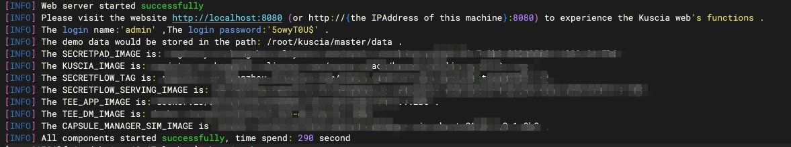
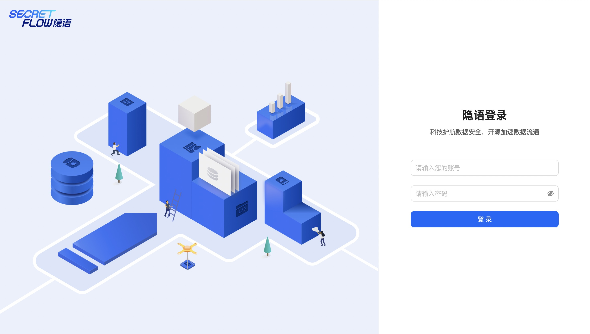

# Secretpad部署指引

目前 Secretpad 支持中心化节点部署、 Edge 节点部署和 p2p 节点三种部署方式，请根据部署环境选择相应的部署方式。

## 前置准备

Secretpad 对部署环境有一定要求，请参考[部署要求](./request.md)提前准备好环境

### 下载安装包

- linux/amd64 [secretflow-allinone-linux-x86_64-latest.tar.gz](https://secretflow-public.oss-cn-hangzhou.aliyuncs.com/mvp-packages/secretflow-allinone-linux-x86_64-latest.tar.gz)部署
- linux/arm64 [secretflow-allinone-linux-aarch_64-latest.tar.gz](https://secretflow-public.oss-cn-hangzhou.aliyuncs.com/mvp-packages/secretflow-allinone-linux-aarch_64-latest.tar.gz)部署
- 通过[脚本](https://github.com/secretflow/secretpad/blob/main/scripts/install.sh)部署

### install.sh参数详解

| 参数名 |                                                                                             含义                                                                                              | 是否必填 |     默认值      |      可选项
|:---:|:-------------------------------------------------------------------------------------------------------------------------------------------------------------------------------------------:|:----:|:------------:|:--------------:|
| -m  | 在lite模式/p2p多节点模式使用。lite 模式指定了主节点的地址，p2p 多节点模式指定了 secretpad 的页面入口地址，表示当前注册机构的地址。 在lite模式下 -m 中有http https，表示协议:与—P参数对应关系，notls -> http, (tls,mtls) -> https.  在p2p多节点模式下 -m 中只有http. |  否   |      -       |       -        |
| -n  |                                                                                        用于指定要部署的域名ID                                                                                         |  否   |      -       |       -        |
| -s  |                                                                                     secretpad-web暴露的端口号                                                                                     |  否   |     8080     |       -        |
| -p  |                                                                                    kuscia-gateway暴露的端口号                                                                                     |  否   |    18080     |       -        |
| -k  |                                                                                    kuscia-api-http暴露的端口号                                                                                    |  否   |    40802     |       -        |
| -g  |                                                                                    kuscia-api-grpc暴露的端口号                                                                                    |  否   |    40803     |       -        |
| -t  |                                                                       在lite模式/P2P多节点部署使用。它指定了部署令牌，可以从secretpad平台获取此令牌                                                                       |  否   |      -       |
| -d  |                                                                                            安装目录                                                                                             |  否   | $HOME/kuscia |       -        |
| -P  |                                                                                          kuscia协议                                                                                           |  否   |     tls      | tls、notls、mtls |
| -q  |                                                       仅在autonomy或lite模式下使用。它指定了用于域内部使用的端口号。您可以通过设置环境变量'DOMAIN_HOST_INTERNAL_PORT'来代替                                                        |  否   |    13081     |       -        |
| -h  |                                                                                           显示帮助文本                                                                                            |  否   |      -       |       -        |
| -x  |                                                                                   kuscia METRICS_PORT监控端口                                                                                   |  否   |    13084     |       -        |

## 中心化节点部署

中心化节点部署参考：[中心化节点部署](./master.md)

## Edge 节点部署

Edge节点部署参考：[Edge节点部署](./edge.md)

## p2p 模式部署

Edge节点部署参考：[p2p 模式部署](./p2p.md)

## Secretpad 本地调试

本地调试参考：[本地调试](../development/ru_in_idea_cn.md)

## 验证部署

看到 “web server started successfully” 则代表部署成功

> 注意：默认账户 admin，默认密码为随机七位大小写字母和数字，一位特殊字符
>
> 上图中：The login name:'admin' ,The login password:'5owyT0U$' .
>
> 默认账号：admin，默认密码：5o*****
>
> 如果忘记默认密码，请参考[日志说明](./log.md#secretpad默认密码查看)，在日志中找到默认密码。
>
> 请勿在生产环境中使用弱口令

部署成功后，浏览器打开 http://{ip地址}: Secretpad 端口号，利用部署过程中配置的用户密码登陆平台即可体验。

### 操作文档

- 中心化节点部署操作参考：[中心化节点部署操作](../operation/master.md)
- Edge节点部署操作参考：[Edge节点部署操作](../operation/edge.md)
- p2p模式部署操作参考：[p2p模式部署操作](../operation/p2p.md)

## 故障排查

部署过程中遇到问题可以先参考[常见问题](../asked/qa.md)进行排查

若在部署过程中有相关的问题或建议，可提交[Issues](https://github.com/secretflow/secretpad/issues)反馈。