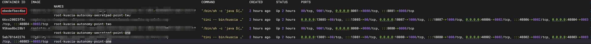
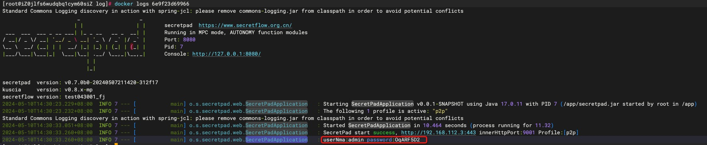

# 日志查看

## 前言

日志在应用部署、业务运行和故障排除的过程中起到了非常的重要，本文将详细的描述日志对应的路径以及各个日志文件的主要用途。

## 查看 Secretpad 日志挂载目录

### 第1步：查看 CONTAINER ID
```shell
docker ps
```

### 第2步：查看Mounts
```shell
docker inspect ebedefbec4be
```
```json
"Mounts": [
    {
        "Type": "bind",
        "Source": "/root/kuscia/autonomy/data",
        "Destination": "/app/data",
        "Mode": "",
        "RW": true,
        "Propagation": "rprivate"
    },
    {
        "Type": "bind",
        "Source": "/root/kuscia/autonomy/secretpad/point-two/log",
        "Destination": "/app/log",
        "Mode": "",
        "RW": true,
        "Propagation": "rprivate"
    },
    {
        "Type": "bind",
        "Source": "/root/kuscia/autonomy/secretpad/point-two/config",
        "Destination": "/app/config",
        "Mode": "",
        "RW": true,
        "Propagation": "rprivate"
    },
    {
        "Type": "bind",
        "Source": "/root/kuscia/autonomy/secretpad/point-two/db",
        "Destination": "/app/db",
        "Mode": "",
        "RW": true,
        "Propagation": "rprivate"
    }
],
```
### 第3步：查看日志
```shell
cd /root/kuscia/autonomy/secretpad/point-two/log
ls -al
```

## secretpad目录结构

```text
.
├── config
│   ├── application-dev.yaml
│   ├── application-edge.yaml
│   ├── application-p2p.yaml
│   ├── application-test.yaml
│   ├── application.yaml
│   ├── certs
│   ├── components
│   │   ├── secretflow.json
│   │   ├── secretpad.json
│   │   └── trustedflow.json
│   ├── i18n
│   │   ├── secretflow.json
│   │   ├── secretpad.json
│   │   └── trustedflow.json
│   ├── schema
│   │   ├── center
│   │   ├── edge
│   │   └── p2p
│   ├── schemamysql
│   │   ├── create_table.sql
│   │   └── insert.sql
│   └── server.jks
├── db
│   ├── secretpad.sqlite
│   ├── secretpad.sqlite-shm
│   └── secretpad.sqlite-wal
└── log
    ├── data-sync.log
    ├── error.log
    └── secretpad.log
```

| 文件夹名称  | 文件夹说明                 |
|--------|-----------------------|
| config | 用于存放 Secretpad 配置文件信息 |
| db     | sqlite 数据库            |
| log    | 存放 Secretpad 日志文件     |

## 日志文件说明

| 文件名称          | 文件路径                                                          | 文件说明                                   |
|---------------|---------------------------------------------------------------|----------------------------------------|
| secretpad.log | /root/kuscia/master/secretpad/kuscia-system/log/secretpad.log | 主要记录了应用启动过程中的日志信息，包括应用启动成功、失败等信息。      |
| error.log     | /root/kuscia/master/secretpad/kuscia-system/log/error.log     | 主要记录了应用运行过程中出现的错误信息，包括数据库连接异常、网络异常等信息。 |
| data-sync.log | /root/kuscia/master/secretpad/kuscia/data-sync.log            | 主要记录了数据同步过程中的日志信息，包括数据同步成功、失败等信息。      |

## 日志格式以及滚动策略

### secretpad.log

```text
%d{yyyy-MM-dd HH:mm:ss} [%thread] %-5level %logger{36} - %msg%n
```

具体含义如下：
- `%d{yyyy-MM-dd HH:mm:ss}`：日期时间，格式为“yyyy-MM-dd HH:mm:ss”。
- `%thread`：线程名。
- `%-5level`：日志级别，左对齐，至少占用5个字符宽度。
- `%logger{36}`：日志记录器名，最多输出36个字符。
- `%msg%n`：日志消息，后面跟着一个换行符。

日志文件滚动策略
- 每个日志文件的最大大小为50MB
- 最多保留的日志文件数量为15个
- 所有日志文件的总大小限制为512MB
- 启动时清除旧的日志文件

### error.log
```text
%d{yyyy-MM-dd HH:mm:ss} [%thread] %-5level %logger{36} - %msg%n
```
具体含义如下：
- `%d{yyyy-MM-dd HH:mm:ss}`：日期时间，格式为“yyyy-MM-dd HH:mm:ss”。
- `%thread`：线程名。
- `%-5level`：日志级别，左对齐，至少占用5个字符宽度。
- `%logger{36}`：日志记录器名，最多输出36个字符。
- `%msg%n`：日志消息，后面跟着一个换行符。

日志文件滚动策略
- 每个日志文件的最大大小为1GB
- 最多保留的日志文件数量为7个
- 所有日志文件的总大小限制为5GB
- 启动时清除旧的日志文件

### data-sync.log

```text
%d{yyyy-MM-dd HH:mm:ss} [%thread] %-5level %logger{36} - %msg%n
```

具体含义如下：
- `%d{yyyy-MM-dd HH:mm:ss}`：日期时间，格式为“yyyy-MM-dd HH:mm:ss”。
- `%thread`：线程名。
- `%-5level`：日志级别，左对齐，至少占用5个字符宽度。
- `%logger{36}`：日志记录器名，最多输出36个字符。
- `%msg%n`：日志消息，后面跟着一个换行符。

日志文件滚动策略
- 每个日志文件的最大大小为1GB
- 最多保留的日志文件数量为7个
- 所有日志文件的总大小限制为5GB
- 启动时清除旧的日志文件

## secretpad默认密码查看

如在部署过程中忘记默认密码可在启动控制台查看密码，具体查看步骤如下：

### 第1步：查看CONTAINER ID
```shell
docker ps
```


### 第2步：查看CONTAINER日志
```shell
docker logs ebedefbec4be
```

