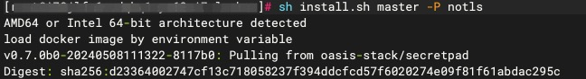

# 中心化节点部署

## 第1步：环境准备

请参考：[部署要求](./request.md)

## 第2步：解压部署包

```shell
tar -xzf secretflow-allinone-linux-x86_64-latest.tar.gz
```

## 第3步：安装部署

```shell
cd secretflow-allinone-linux-x86_64-latest

# notls -> http, tls -> https
bash install.sh master -P notls
```
命令参数可以参考[install.sh参数说明](./guide.md#installsh参数详解)



## 第4步：设置登录web页面的用户名和密码
用户名长度要求大于 4 位字符 ，密码不低于 8 位字符。需包含大小写及数字。


## 第5步：安装完成
看到“web server started successfully”则代表部署成功


## 第6步：部署验证
请参考部署文档[验证部署](./guide.md#验证部署)

## 第7步：操作体验
请参考中心化节点部署[操作文档](../operation/master.md)

若在部署过程中有相关的问题或建议，可提交[Issues](https://github.com/secretflow/secretpad/issues)反馈。