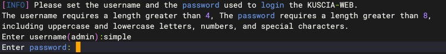

# P2P节点部署

## 第1步：环境准备

请参考：[部署要求](./request.md)

## 第2步：安装部署
> Tips:节点名称由用户自定义，最多 63 个字符，只能包含小写字母、数字，以及 '-'，且必须以字母或数字开头，必须以字母或数字结尾，默认节点名称就是节点ID，
> 默认部署成功就是一个节点，如需安装新的节点，重复操作即可，注意一台电脑安装两个节点需保证两个节点名称/路径/端口均不同。

```shell
# 进入install.sh所在目录
cd 进入 install.sh 所在目录

bash install.sh autonomy -n point-one -s 8080 -g 40803 -k 40802 -p 18080 -q 13081 -P notls
```
命令参数可以参考[install.sh参数说明](./guide.md#installsh参数详解)

## 第3步：设置登录web页面的用户名和密码
用户名长度要求大于 4 位字符 ，密码不低于 8 位字符。需包含大小写及数字。



## 第4步：安装完成
看到 “web server started successfully” 则代表部署成功


## 第5步：部署验证
请参考部署文档[验证部署](./guide.md#验证部署)

## 第6步：操作体验
请参考p2p模式部署[操作文档](../operation/p2p.md)


若在部署过程中有相关的问题或建议，可提交[Issues](https://github.com/secretflow/secretpad/issues)反馈。