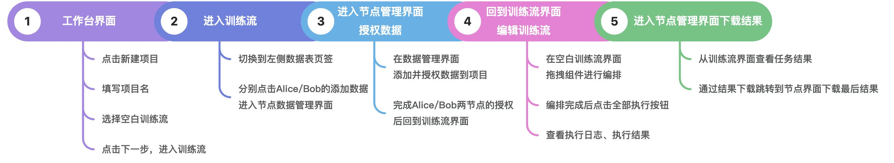
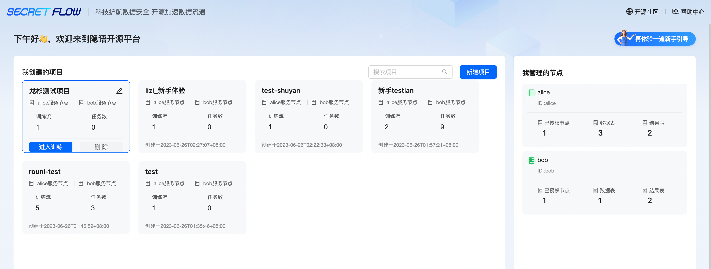
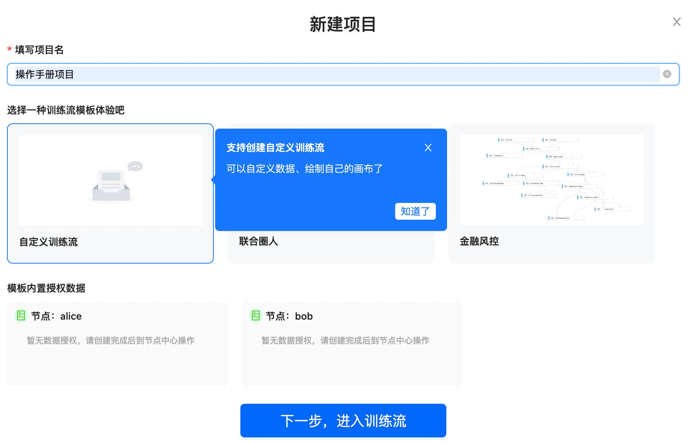
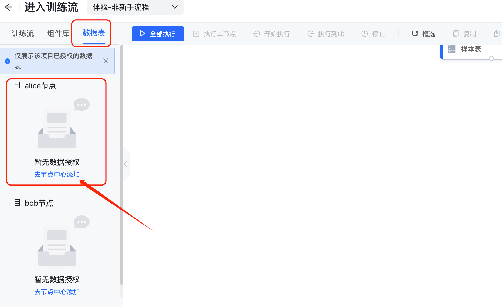
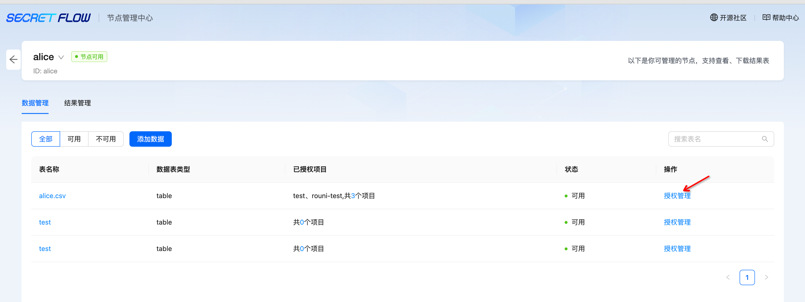
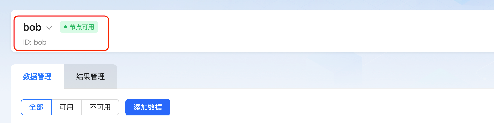
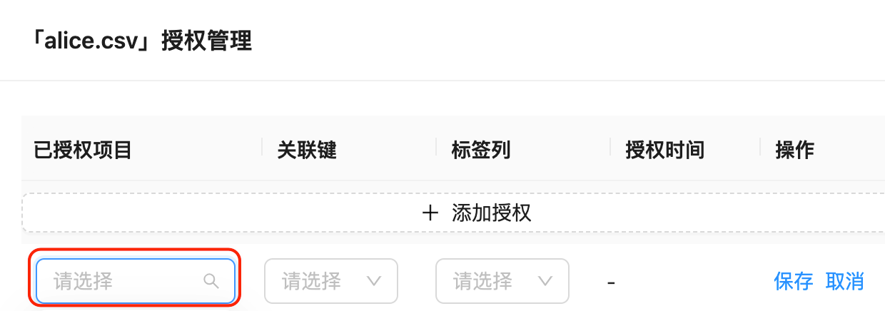
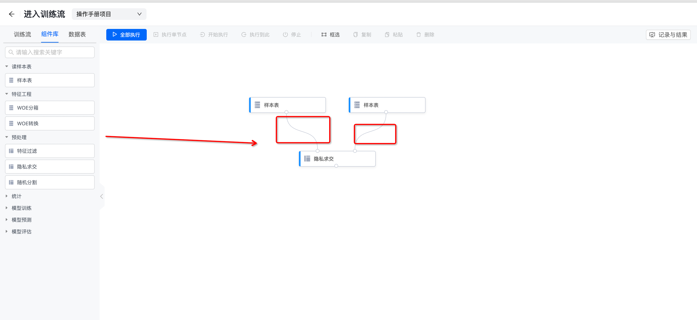
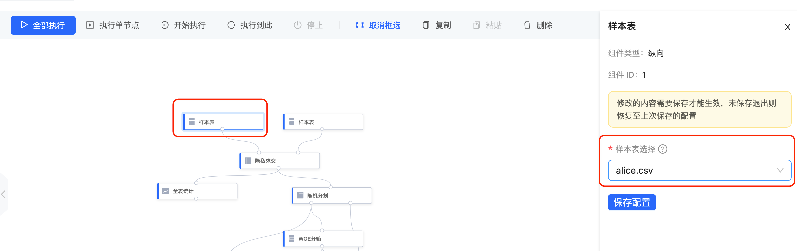
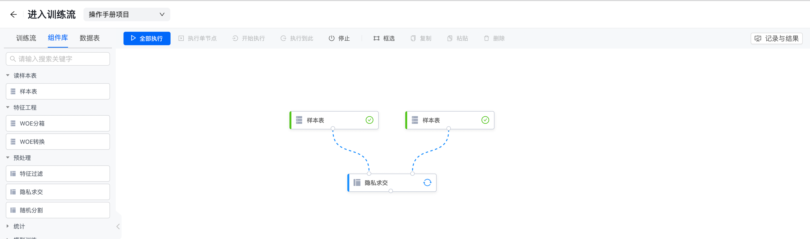

# 方式二：管道模式全流程

管道模式：MPC 多方安全计算模式

<video id="video" controls="" preload="none">
<source id="mp4" src="https://secretflow-public.oss-cn-hangzhou.aliyuncs.com/tutorial-video/pipeline_custom.mp4" type="video/mp4">
</video>

# 一、管道模式自定义训练流全流程

# 二、详细步骤说明

## 第 1 步：进入工作台界面——点击新建项目

## 第 2 步：输入项目名称——选择自定义训练流——选择参与节点——点击保存，进入训练流

## 第 3 步：进入训练流——点击数据表

## 第 4 步：跳转到节点管理中心，分别授权 Alice、Bob 数据表给项目使用

## 第 5 步：选择需要授权的项目、关联键（可关联两张表的唯一值）、标签列（非必填）

## 第 6 步：授权完成后，回到之前的训练流界面——点击组件库，可拖拽组件到画布上进行流程搭建

ps：搭建过程中，注意组件的连接方式是否正确

## 第 7 步：点击组件“样本表”——选择数据表——保存配置

## 第 8 步：流程搭建完成后——点击全部执行按钮，执行训练流

## 第 9 步：移动鼠标到对应的组件面板——点击执行结果——查看并下载数据表

