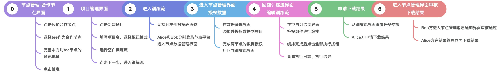
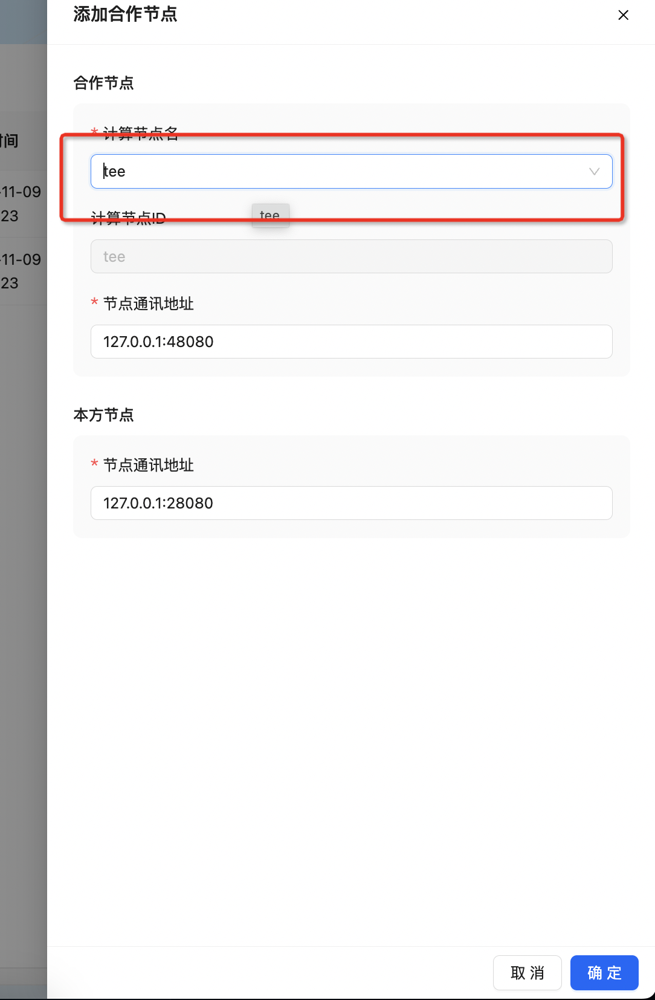
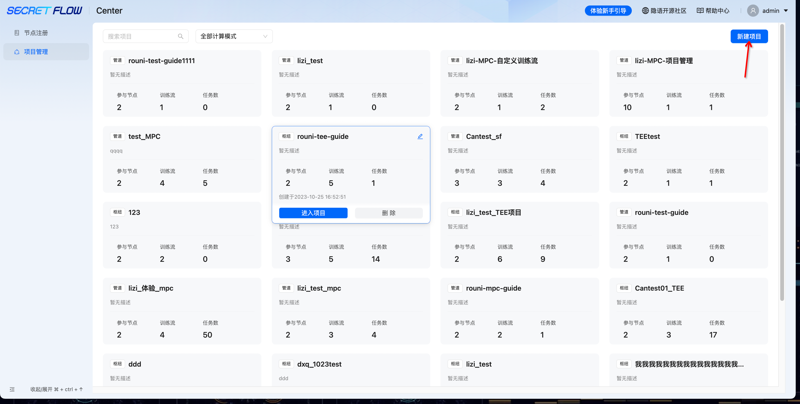
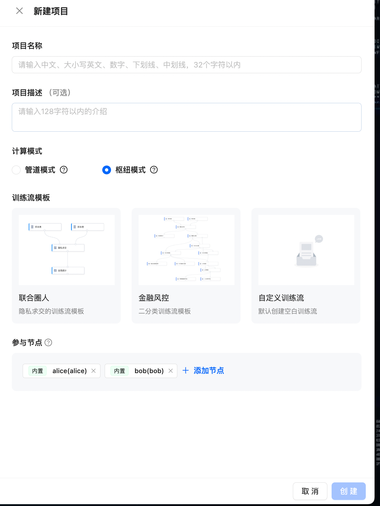
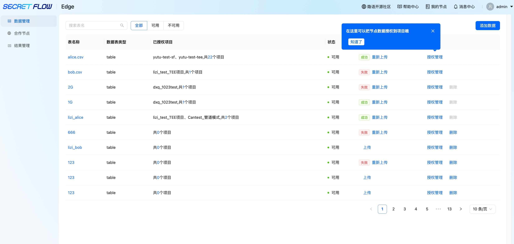
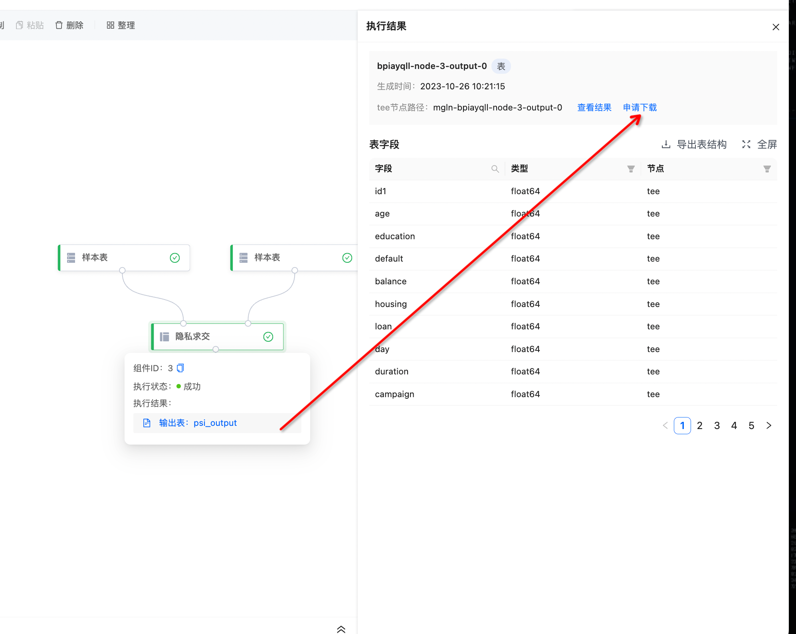
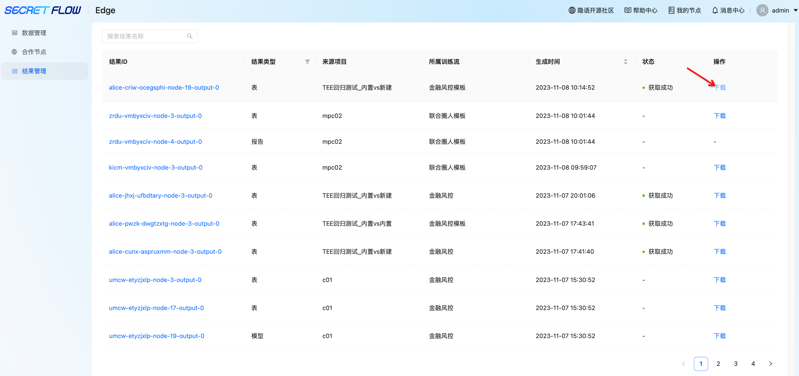

# 方式三：枢纽模式全流程

枢纽模式：TEE 集中式计算模式

# 一、枢纽模式自定义训练全流程

# 二、详细步骤说明

## 第 0 步：枢纽模式TEE节点添加合作

若需要使用枢纽模式，则需要提前将自己的节点和TEE的节点完成添加合作：登录edge平台——点击添加合作节点——选择tee计算节点——完善本方节点通讯地址——点击确定。

## 第 1 步：进入项目管理界面——点击新建项目

## 第 2 步：输入项目名称——选择计算模式枢纽模式——选择自定义训练流——选择参与节点——点击创建，进入训练流

## 第 3 步：进入训练流——点击数据表

## 第4步：进入edge平台，分别授权 Alice、Bob 数据表给项目使用（授权给项目的时候会自动上传数据到中心TEE中）。

若本地数据有更新，则可通过界面的【重新上传】更新TEE中的数据。

## 第 5 步：选择需要授权的项目、关联键（可关联两张表的唯一值）、标签列（非必填）。

## 第 6 步：授权完成后，回到之前的训练流界面——点击组件库，可拖拽组件到画布上进行流程搭建。

ps：搭建过程中，注意组件的连接方式是否正确

## 第 7 步：点击组件“样本表”——选择数据表——保存配置

## 第 8 步：流程搭建完成后——点击全部执行按钮，执行训练流。

## 第 9 步：移动鼠标到对应的组件面板——点击执行结果——申请数据表

## 第10步：alice发起申请下载——bob进入edge平台，在消息中心审核通过——alice在edge平台结果管理中下载结果

