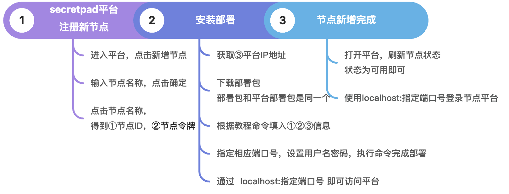
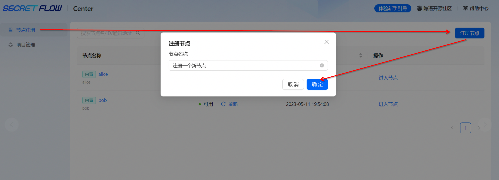
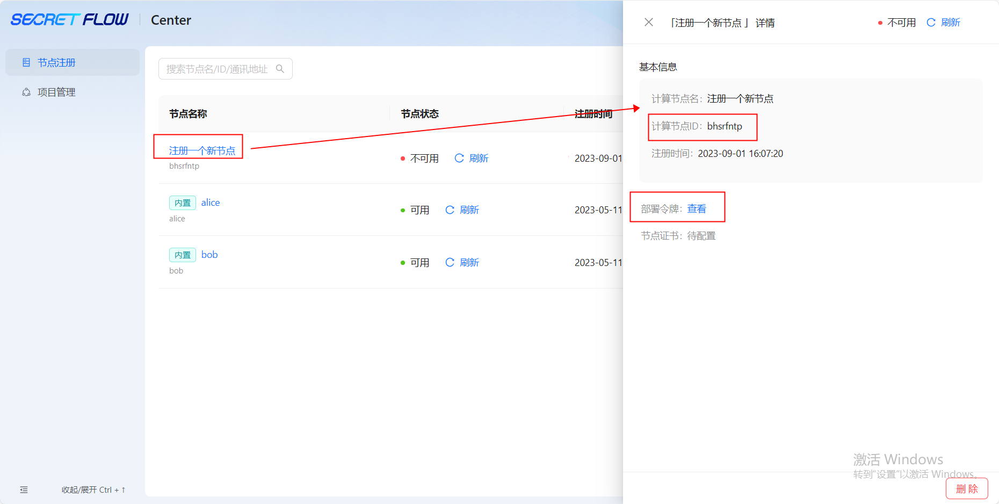
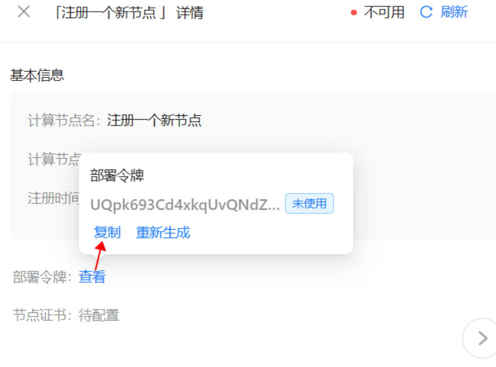
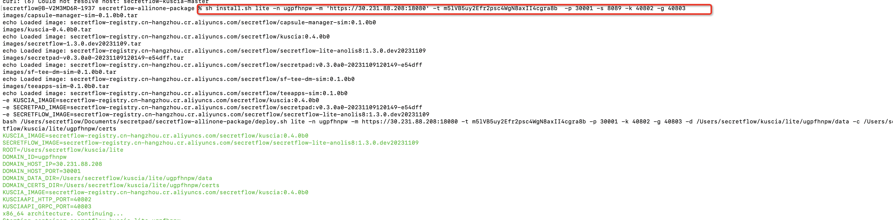
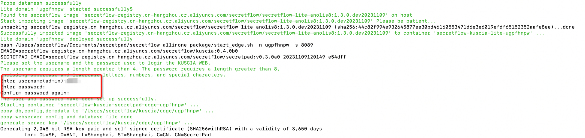
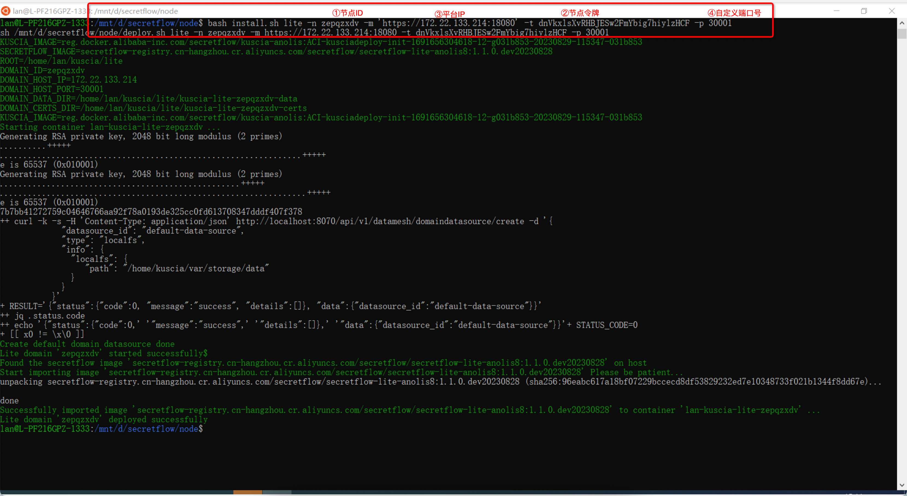
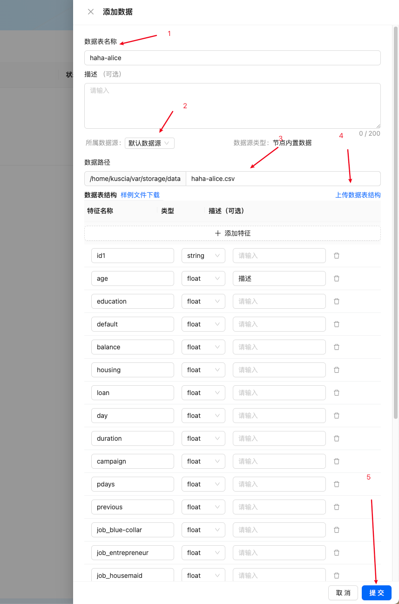
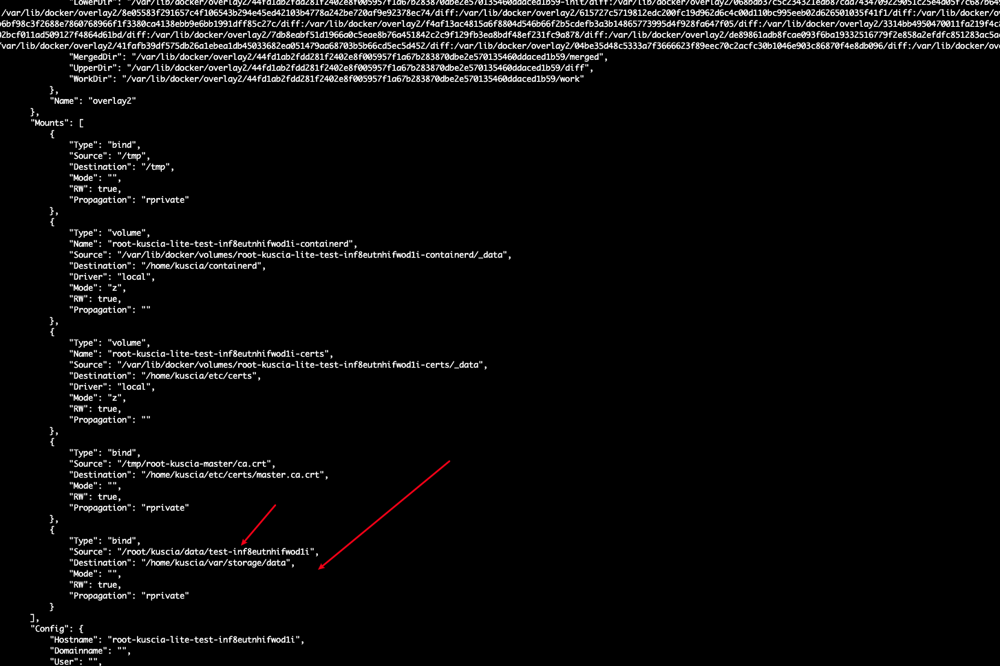
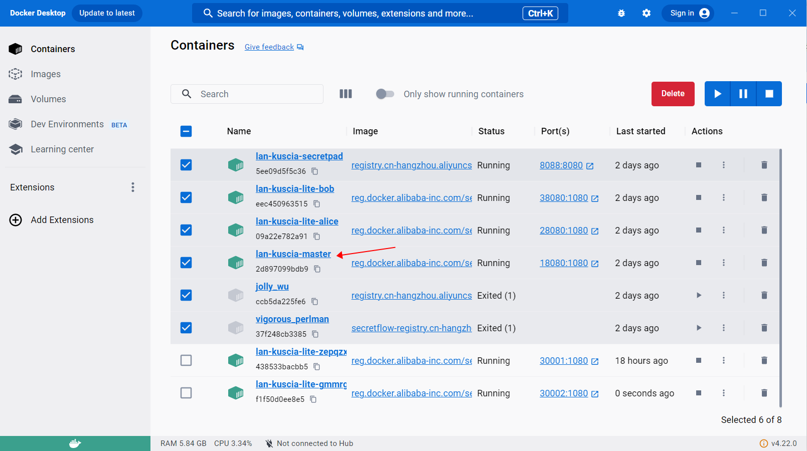

# 节点安装指引

# 节点部署

系统要求及docker安装指引参考平台安装指引目录。

节点新增部署流程如下：



## 第 1 步：节点注册-获取节点ID、节点令牌



点击节点名称获取：①节点ID、②节点部署令牌





## 第 2 步：获取Centre平台所在的ip地址-下载并解压部署包-安装部署

若是同一网络内，则只需获取本机的ip地址即可，以mac为例，通过ifconfig命令获取③ip地址。

若是跨网部署，则需要运维人员生成外网IP。

部署包和secretpad的部署包是同一个，所以直接下载解压secretpad的部署包即可。

mac的命令：

```shell
cd 部署包所在路径
sh install.sh lite -n ①平台的节点id -m 'https://③master的IP:18080' -t ②页面token -p ④kuscia Lite 节点的 gateway 端口 -s ⑤secretpad edge 侧 web 端口 -k ⑥kuscia Lite 节点 API HTTP 端口 -g ⑦uscia Lite 节点 API GRPC 端口
```

输入 cd ——把解压的安装包拖入到终端（或输入sercretpad_pkg的路径）——再输入 sh install.sh lite -n ①平台的节点id
-m 'https://③master的IP:18080' -t ②页面token -p 端口号(一般从30001开始） -s 端口号（推荐8089开始） -k 端口号（推荐40802） -g
端口号（推荐40803）



WSL的命令：

```shell
cd 部署包所在路径
bash install.sh lite -n ①平台的节点id -m 'https://③master的IP:18080' -t ②页面token -p ④kuscia Lite 节点的 gateway 端口 -s ⑤secretpad edge 侧 web 端口 -k ⑥kuscia Lite 节点 API HTTP 端口 -g ⑦uscia Lite 节点 API GRPC 端口
```

需要输入用户名密码，用于登陆节点平台（密码8位，由大小写字母和特殊字符组成）。



看到“Lite domain xxxxx deployed successfull”的提示即完成部署



## 第 3 步：浏览器访问节点平台

本次新增的节点平台可以直接用浏览器打开 http://localhost：指定端口号 访问，内置的Alice和Bob节点可以直接访问管理数据，新注册的节点需要通过节点平台访问管理数据。


由于本次新增节点的数据管理功能暂不能直接拖csv文件进行注册，所以需要将文件放到指定目录下才能进行注册，新注册的节点数据管理edge平台界面操作如下：



# 数据添加：手动上传文件到服务器指定目录

目前kuscia 使用 docker 部署，docker有磁盘挂载点，算子数据源和结果目前都在 docker容器的/home/kuscia/var/storage/data 目录下

使用命令

```shell
docker ps
```



如上图，可以看到宿主机 目录是 /root/kuscia/data/test-inf8eutnhifwod1i

我们就把实体数据文件上传到该目录下

```shell
rz
```

上传文件名字要和创建的时候一致 比如 haha-alice.csv

# 注意事项：机器关闭导致节点不可用

- 若机器关闭重启导致IP改变后节点会变成不可用状态，则需要进到节点的容器里改一下配置将③masterIP改为最新的ip；

- 若新增节点跟master是如果是在一台机器上， 可以设置master的域名，不用ip。 比如https://${master容器名}:1080

如：找到容器名——输入命令行：bash install.sh lite -n gmmrgcgt -m 'https://lan-kuscia-master:1080' -t
nNiJL6sKjSmVJUuyj66AK7k6rWT9DMqA -p 30002——回车即可创建节点成功。



# 增加节点用户权限描述

中心化部署模式下，Edge平台成功安装后，可登陆Center平台。Center平台的用户名为计算节点id，密码可通过Edge平台-查看我的节点获取。登录到Center平台，可以看到自己节点的信息和合作项目。Center平台上账号隔离，不可见其他节点信息。