# Center平台安装指引

# 一、安装指引

## 1.1 系统要求

操作系统：MacOS（暂不支持M1芯片）, CentOS7, CentOS8

资源：8core / 16G Memory / 200G Hard disk

## 1.2 Docker安装与配置

若已安装可跳过

### Linux（CentOS）

```shell
# 安装 docker。
yum install -y yum-utils
yum-config-manager \
	--add-repo \
	https://download.docker.com/linux/centos/docker-ce.repo
yum install -y docker-ce docker-ce-cli containerd.io

# 启动 docker。
systemctl start docker
```

其他 OS 可参考 Docker 官方文档：https://docs.docker.com/engine/install/（其他 OS 暂未进行系统性测试，若安装过程中出现问题，可提交
[issue](https://github.com/secretflow/secretflow/issues) 反馈，欢迎开发者们提供相应解决方案）

### Windows系统

参考[Docker官方文档](https://docs.docker.com/desktop/install/windows-install/)在 Windows 上安装 Docker，并确保 Docker
的后段是**WSL2**

MacOS 需将 docker container 内存上限提⾼为 6G。

参考[WSL官方文档](https://learn.microsoft.com/en-us/windows/wsl/wsl-config#configure-global-options-with-wslconfig)
设置对应的设置即可

### mac OS

参考官网进行安装

https://docs.docker.com/desktop/install/mac-install/

### <font color=#DF2A3F> 非常重要📢 ： Docker 配置 </font>

**需将 docker container 内存上限提高为 6G，操作步骤如下（版本不同操作入口可能不同）：**

示例一（V4.3.1）：

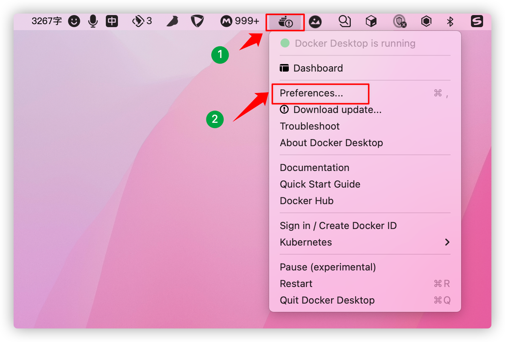 

示例二（V4.20.1）：

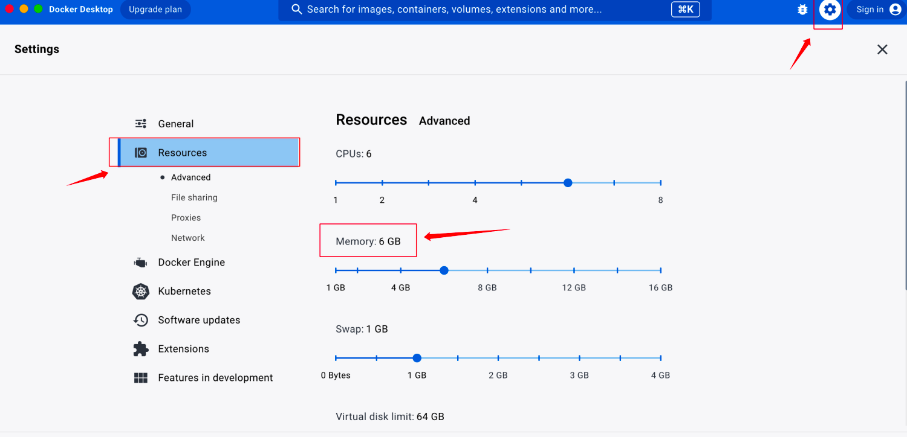

## 1.3 隐语体验部署包安装（mac）

### 第1步：解压部署包

下载部署包后解压

### 第2步：安装部署

```shell
cd 
./install.sh
```

输入 cd ——把解压的安装包拖入到终端（或输入sercretpad-allinone-package的路径）——再输入 ./install.sh

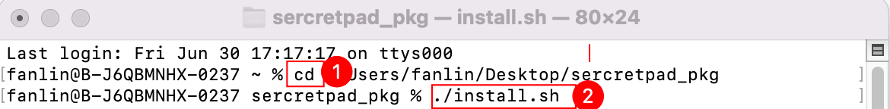

设置任务产物存储目录， 若不设置则直接回车跳过。（默认~/kusica）

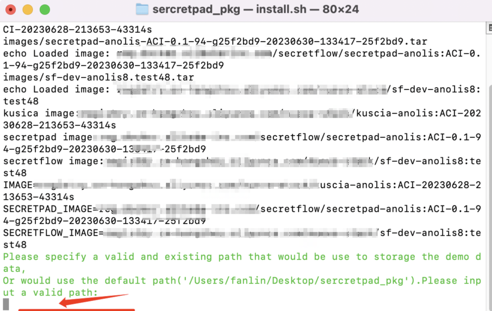

### 第3步：设置登录web页面的用户名和密码

用户名长度要求大于 4 位字符 ，密码大于 8 位字符。需包含大小写及特殊字符。

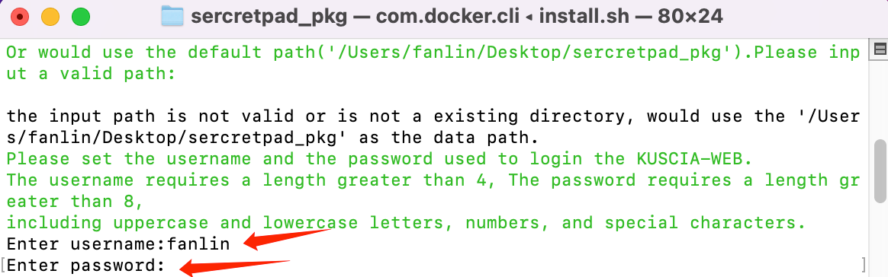

### 第4步：安装完成

看到“web server started successfully”即为部署成功

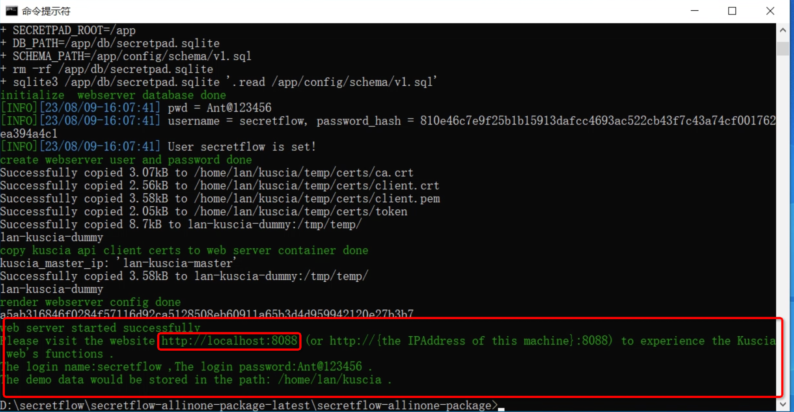


### 第5步：浏览器访问平台

部署成功后，浏览器打开 http://localhost:secretpad 端口号（或者 http://部署服务器的ip:secretpad端口号），利用部署过程中配置的用户密码登录平台即可体验

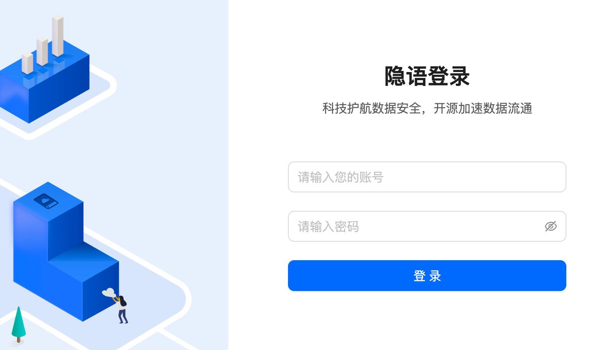

若在部署过程中有相关的问题或者建议，可提交[issue](https://github.com/secretflow/secretflow/issues)
反馈。

## 1.4 隐语体验部署包安装（win）

### 第 1 步：解压部署包

下载部署包后解压部署包。

### 第 2 步：安装部署

```shell
D：//解压后部署包所在存储盘
cd 
bash install.sh
```

输入 D：（或者C\E\F,找到部署包所以存储盘）——输入cd ——把解压的安装包拖入到终端（或输入sercretpad_pkg的路径）——再输入 bash
install.sh

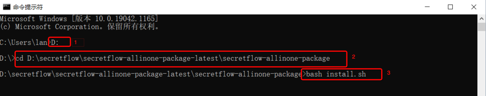

设置任务产物存储目录， 若不设置则直接回车跳过。（默认使用部署包所在目录）

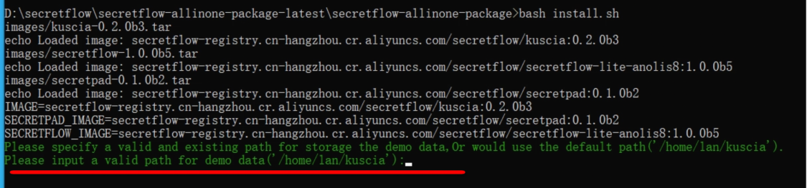

### 第 3 步：设置登录web页面的用户名和密码

用户名长度要求大于 4 位字符 ，密码大于 8 位字符。可含大小写及特殊字符。

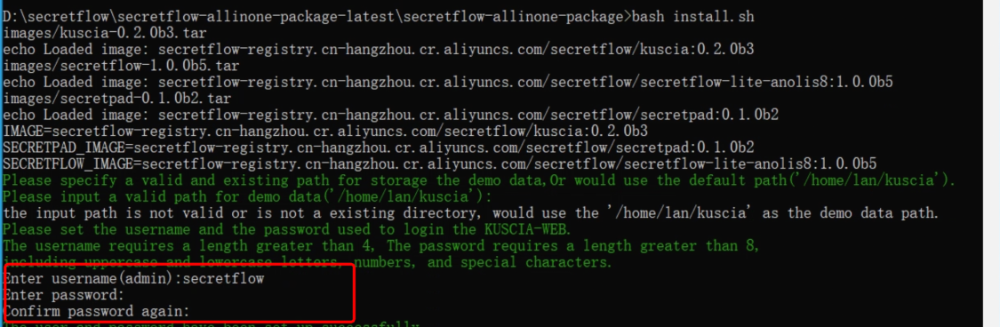

### 第 4 步：安装完成

看到“web server started successfully”则代表部署成功

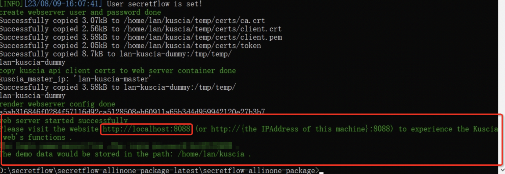
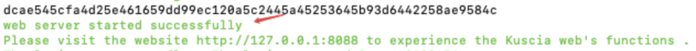

### 第 5 步：浏览器访问平台

部署成功后，浏览器打开 http://localhost:secretpad端口号 ，利用部署过程中配置的用户密码登陆平台即可体验。


若在部署过程中有相关的问题或者建议，可提交[issue](https://github.com/secretflow/secretflow/issues)
反馈。