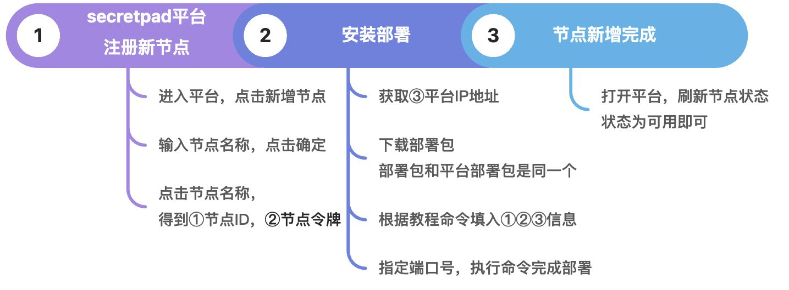
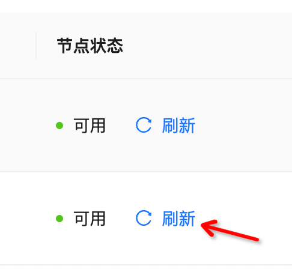

# 节点安装指引

# 节点部署

系统要求及docker安装指引参考平台安装指引目录。

节点新增部署流程如下：



## 第 1 步：节点注册-获取节点ID、节点令牌


点击节点名称获取：①节点ID、②节点部署令牌


## 第 2 步：获取Centre平台所在的ip地址-下载并解压部署包-安装部署

若是同一网络内，则只需获取本机的ip地址即可，以mac为例，通过ifconfig命令获取③ip地址。


若是跨网部署，则需要运维人员生成外网IP。

部署包和secretpad的部署包是同一个，所以直接下载解压secretpad的部署包即可。

mac的命令：

```shell
cd 部署包所在路径
sh install.sh lite -n ①平台的节点id -m 'https://③master的IP:18080' -t ②页面token -p ④自定义端口号
```

输入 cd ——把解压的安装包拖入到终端（或输入sercretpad_pkg的路径）——再输入 sh install.sh lite -n ①平台的节点id
-m 'https://③master的IP:18080' -t ②页面token -p 端口号(一般从30001开始）


WSL的命令：

```shell
cd 部署包所在路径
bash install.sh lite -n ①平台的节点id -m 'https://③master的IP:18080' -t ②页面token -p ④自定义端口号
```


看到“Lite domain xxxxx deployed successfull”的提示即完成部署。

## 第 3 步：打开平台-刷新节点状态

打开secretpad平台，刷新节点状态，状态为可用即安装完成。



由于本次新增节点的数据管理功能暂不能直接拖csv文件进行注册，所以需要将文件放到指定目录下才能进行注册，新注册的节点数据管理edge平台界面操作如下：


# 数据添加：手动上传文件到服务器指定目录

目前kuscia 使用 docker 部署，docker有磁盘挂载点，算子数据源和结果目前都在 docker容器的/home/kuscia/var/storage/data 目录下

使用命令

```shell
docker ps


CONTAINER ID   IMAGE                                                                                  COMMAND                  CREATED          STATUS          PORTS                                               NAMES
d46a9f3e1257   secretflow/kuscia-anolis:v1.0.0                     "bin/entrypoint.sh t…"   17 minutes ago   Up 17 minutes   0.0.0.0:30002->1080/tcp, :::30002->1080/tcp         root-kuscia-lite-test-inf8eutnhifwod1i
fe767050c4cd   secretflow/kuscia-anolis:v1.0.0                     "bin/entrypoint.sh t…"   29 minutes ago   Up 29 minutes   0.0.0.0:30001->1080/tcp, :::30001->1080/tcp         root-kuscia-lite-haha-lnrnah5zvqjkn1u3
ca1cff90f081   secretflow/secretpad:v0.1.0-20230817150718-503d1d   "java -jar -Dsun.net…"   33 minutes ago   Up 33 minutes   80/tcp, 0.0.0.0:8080->8080/tcp, :::8080->8080/tcp   root-kuscia-secretpad
9da866360218   secretflow/kuscia-anolis:v1.0.0                     "bin/entrypoint.sh t…"   35 minutes ago   Up 35 minutes                                                       root-kuscia-lite-bob
1df9b321beac   secretflow/kuscia-anolis:v1.0.0                     "bin/entrypoint.sh t…"   36 minutes ago   Up 35 minutes                                                       root-kuscia-lite-alice
ac1be25f1ae6   secretflow/kuscia-anolis:v1.0.0                     "tini -- scripts/dep…"   36 minutes ago   Up 36 minutes   0.0.0.0:28080->1080/tcp, :::28080->1080/tcp         root-kuscia-master

# d46a9f3e1257 是docker ps 查出来的CONTAINER ID
docker inspect d46a9f3e1257


"Mounts": [
            {
                "Type": "bind",
                "Source": "/tmp",
                "Destination": "/tmp",
                "Mode": "",
                "RW": true,
                "Propagation": "rprivate"
            },
            {
                "Type": "volume",
                "Name": "root-kuscia-lite-test-inf8eutnhifwod1i-containerd",
                "Source": "/var/lib/docker/volumes/root-kuscia-lite-test-inf8eutnhifwod1i-containerd/_data",
                "Destination": "/home/kuscia/containerd",
                "Driver": "local",
                "Mode": "z",
                "RW": true,
                "Propagation": ""
            },
            {
                "Type": "volume",
                "Name": "root-kuscia-lite-test-inf8eutnhifwod1i-certs",
                "Source": "/var/lib/docker/volumes/root-kuscia-lite-test-inf8eutnhifwod1i-certs/_data",
                "Destination": "/home/kuscia/etc/certs",
                "Driver": "local",
                "Mode": "z",
                "RW": true,
                "Propagation": ""
            },
            {
                "Type": "bind",
                "Source": "/tmp/root-kuscia-master/ca.crt",
                "Destination": "/home/kuscia/etc/certs/master.ca.crt",
                "Mode": "",
                "RW": true,
                "Propagation": "rprivate"
            },
            {
                "Type": "bind",
                "Source": "/root/kuscia/data/test-inf8eutnhifwod1i",
                "Destination": "/home/kuscia/var/storage/data",
                "Mode": "",
                "RW": true,
                "Propagation": "rprivate"
            }
        ],
```


如上图，可以看到宿主机 目录是 /root/kuscia/data/test-inf8eutnhifwod1i

我们就把实体数据文件上传到该目录下

```shell
rz
```

上传文件名字要和创建的时候一致 比如 haha-alice.csv

# 注意事项：机器关闭导致节点不可用

- 若机器关闭重启导致IP改变后节点会变成不可用状态，则需要进到节点的容器里改一下配置将③masterIP改为最新的ip；

- 若新增节点跟master是如果是在一台机器上， 可以设置master的域名，不用ip。 比如https://${master容器名}:1080

如：找到容器名——输入命令行：bash install.sh lite -n gmmrgcgt -m 'https://lan-kuscia-master:1080' -t
nNiJL6sKjSmVJUuyj66AK7k6rWT9DMqA -p 30002——回车即可创建节点成功。


*最后更新时间：2023/9/8 14:50:19*