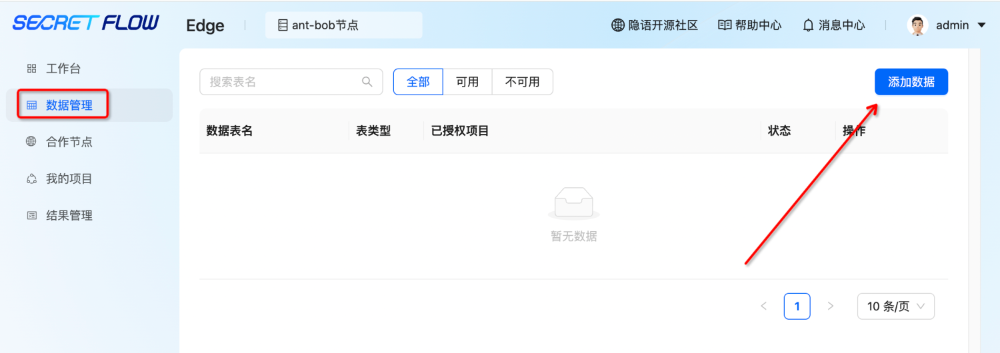
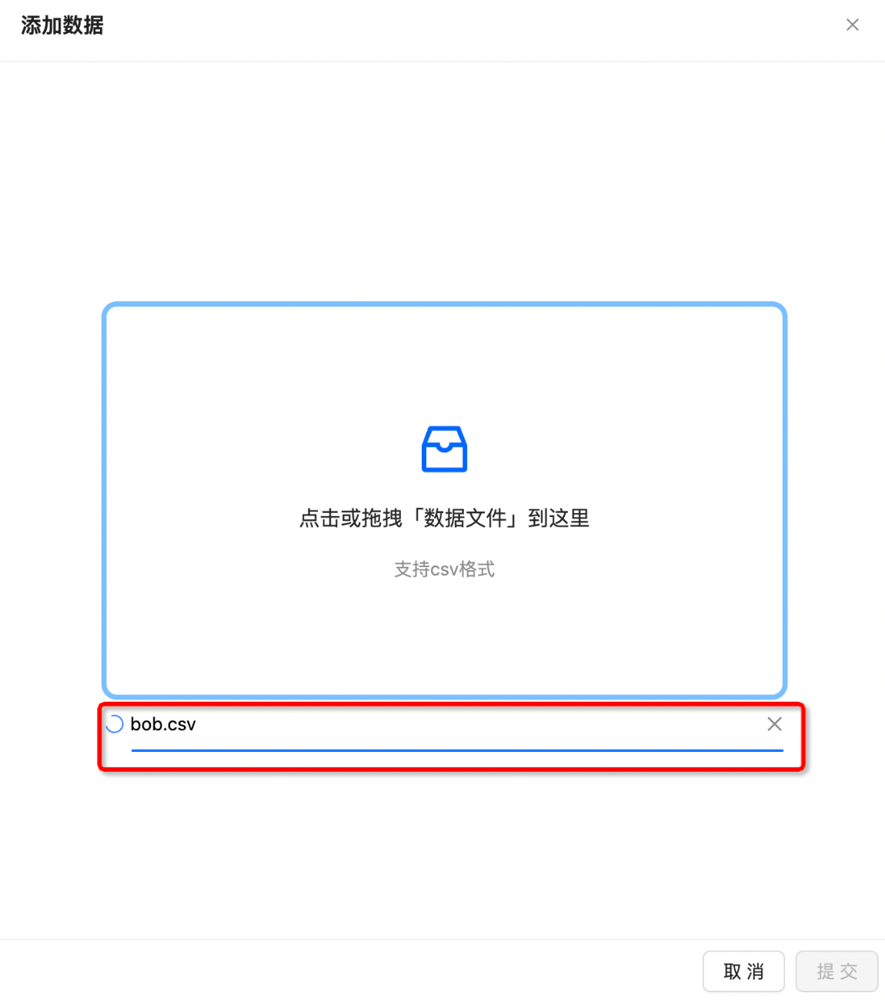
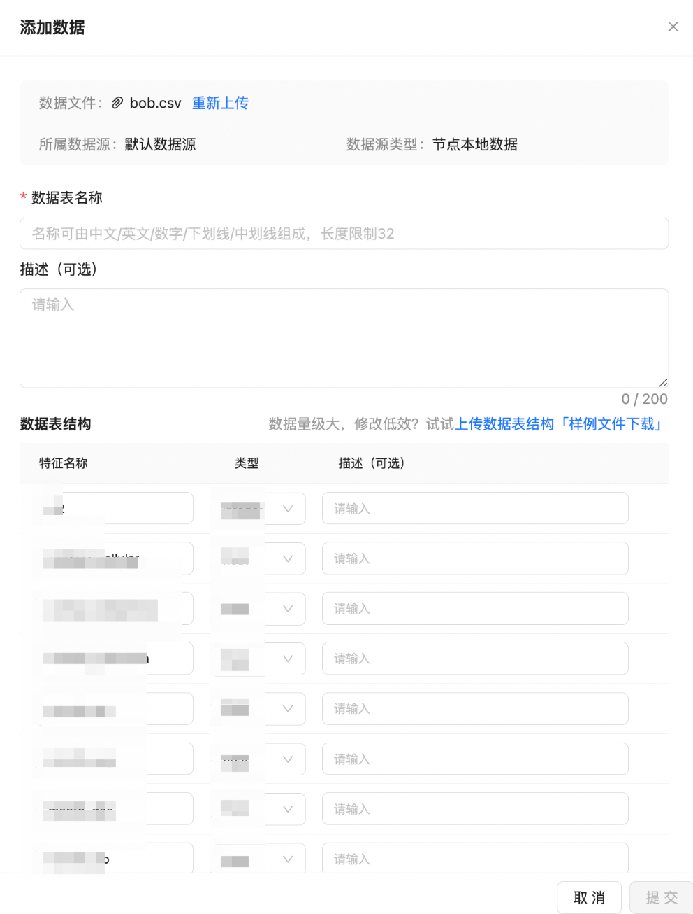
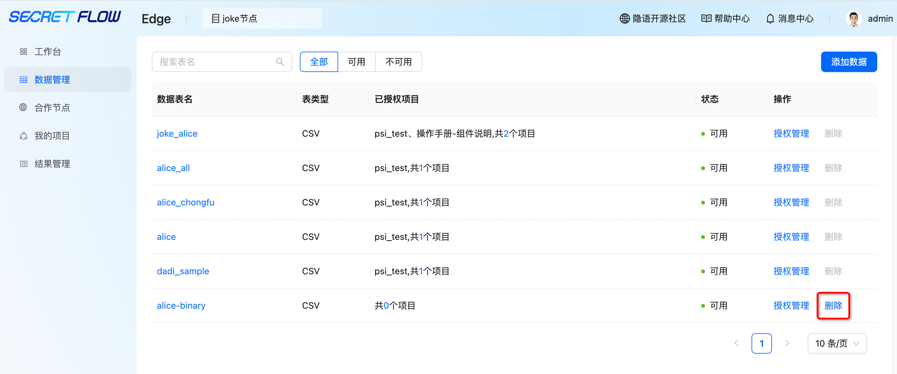
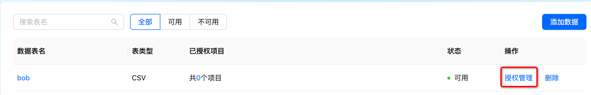
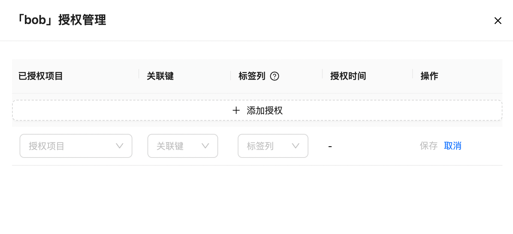
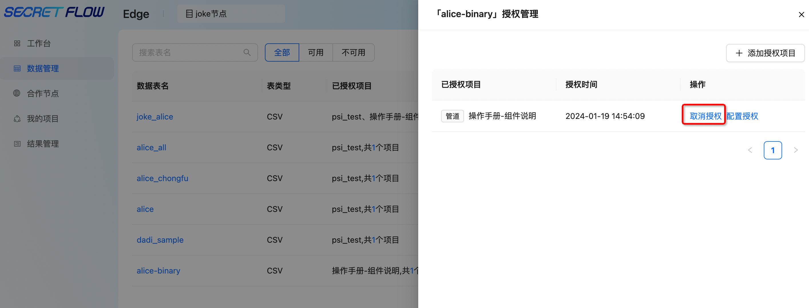

# 数据管理

## 1. 模块说明

本模块主要是对节点自有数据进行管理，包括添加数据、删除数据、进行数据授权、取消数据授权操作

## 2. 添加数据

用户需添加自有数据用于计算训练，数据管理—点击“添加数据”按钮—上传或拖拽本地文件至右侧区域

 注：需在此页面等待数据上传完毕，如中途关闭页面会导致数据上传中断 

设置数据表名称—输入数据表描述及特征描述—点击“提交”。

 重要：特征名称需和实际文件的schame名称保持一致。

## 3. 删除数据

点击“删除”按钮可删除训练数据

 注：已授权到项目中的数据无法删除，删除按钮为灰色 

## 4. 授权管理

若想在某项目中使用节点的数据，需先将数据授权给该项目。点击“授权管理”—“添加授权”—选择“关联项目”、“关联键”（可关联两张表的唯一值）、“标签列”（非必填）—点击“保存”。

 注：双方节点都需上传训练数据并进行授权 

## 5. 取消授权

如需对某一项目取消数据授权，点击“授权管理”—“取消授权”即可

