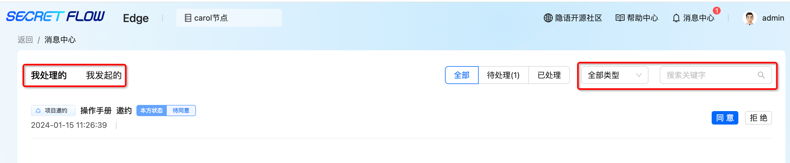
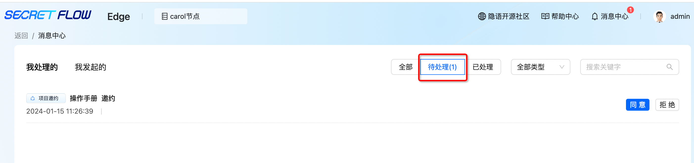
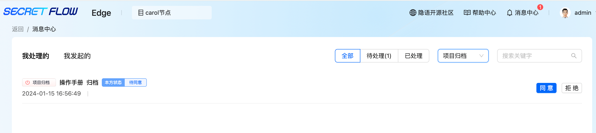

# 消息中心

## 1. 模块说明

本模块主要是查看并处理申请消息，包括“项目邀约”“项目归档”两种申请消息

## 2. 查看消息

消息中心包括“项目邀约”、“项目归档”两种类型的审核消息，可根据消息类型不同、发起方不同、搜索关键字来筛选消息

消息较多时，可点击“待处理”按钮快速查看需本方节点处理的消息

## 3. 处理消息

项目邀约，选择“同意”或“拒绝”

 注：如存在任一节点拒绝项目邀约，项目将直接归档 

项目归档，选择“同意”或“拒绝”

 注：一个项目存在多个参与节点时，需所有参与节点均同意归档申请才会归档成功，若存在任一参与节点拒绝，则归档失败 

