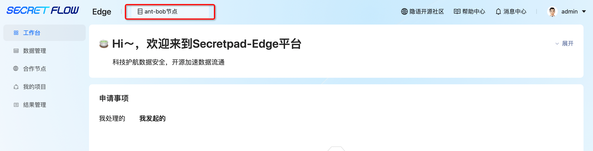
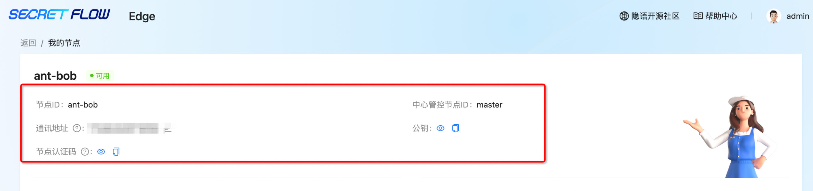
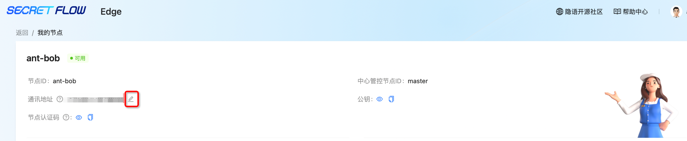
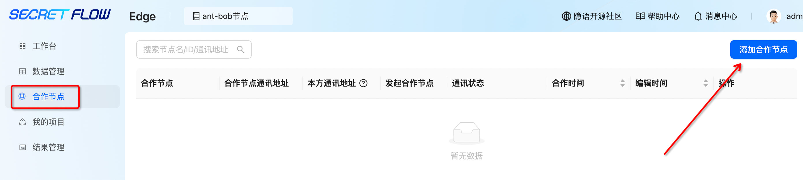
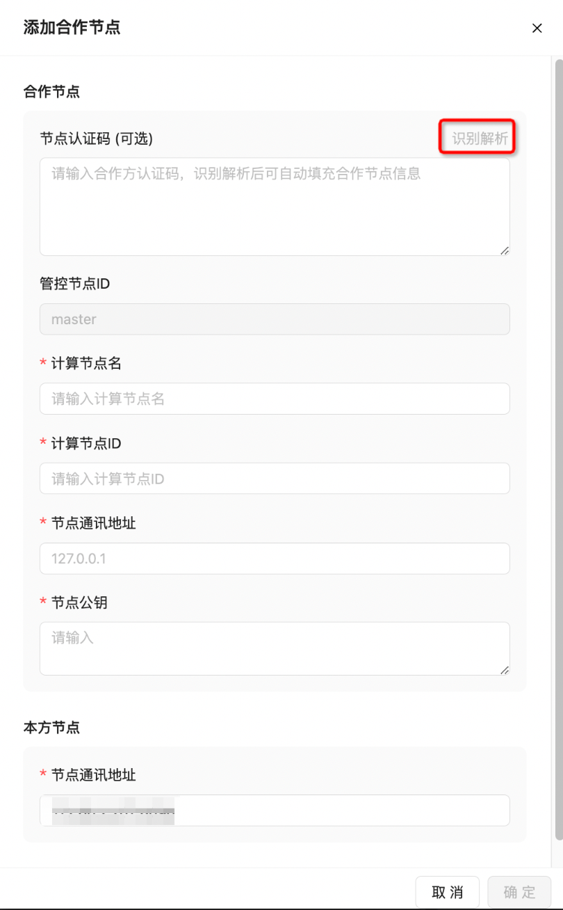
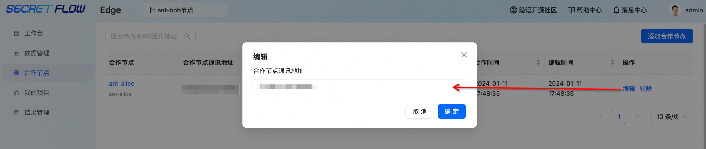
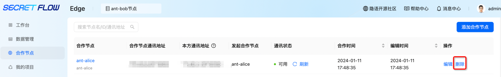

# 合作节点

## 1. 模块说明

本模块主要是对合作节点进行管理，包括查看节点信息、编辑节点信息、添加合作节点、删除合作节点等操作。节点之间通过<添加合作节点>
建立授权关系，此步骤是后续创建合作项目进行联合计算的前提。需要双方分别添加对方节点才可建立双向授权。

## 2. 查看节点信息

平台首页点击“我的节点”查看节点认证码、节点ID、节点名称、公钥信息

推荐用“节点认证码”用于给其他方进行<添加合作节点>操作。

## 3. 编辑节点通讯地址

点击编辑—输入对外通讯地址

 注：默认通讯地址为本机地址，需用户自行修改为对外通讯地址，修改后系统会更新节点认证码。

 由于本机会有多网卡，以及不同局域网和广域网的地址出口ip不同，需要用户自行查看判断IP地址。查看方法：以linux为例，命令行输入命令ifconfig；端口号为部署SecretPad时用户自行确定的Kuscia P2P 节点的gateway端口。

## 4. 添加合作节点

合作节点—点击“添加合作节点”按钮—选择已注册的可用节点—输入合作节点认证码—点击“识别解析”按钮系统会自动填入节点名称、ID等信息（也可手动输入合作节点的名称、节点ID、通讯地址和公钥）—点击“确定”即可建立合作关系

 重要：合作双方需分别添加对应合作节点 

## 5. 修改合作节点通讯地址

点击编辑按钮，修改合作节点通讯地址

 注：已建立合作关系后只允许修改合作节点通讯地址，如需修改合作节点名称、ID等信息，需删除合作后重新建立合作关系。

## 6. 删除合作节点

点击删除按钮，删除合作关系

 注：如存在进行中的任务，不允许进行删除操作，删除按钮为灰色 

