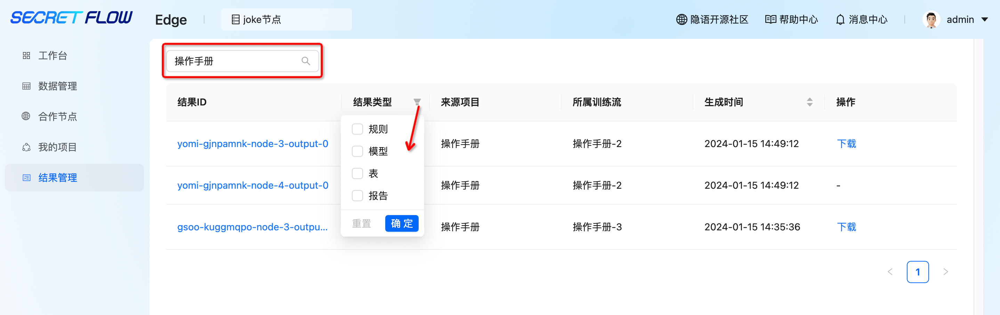
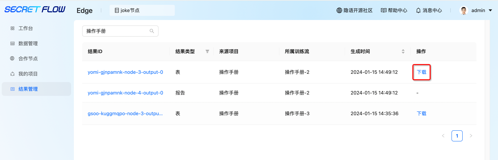
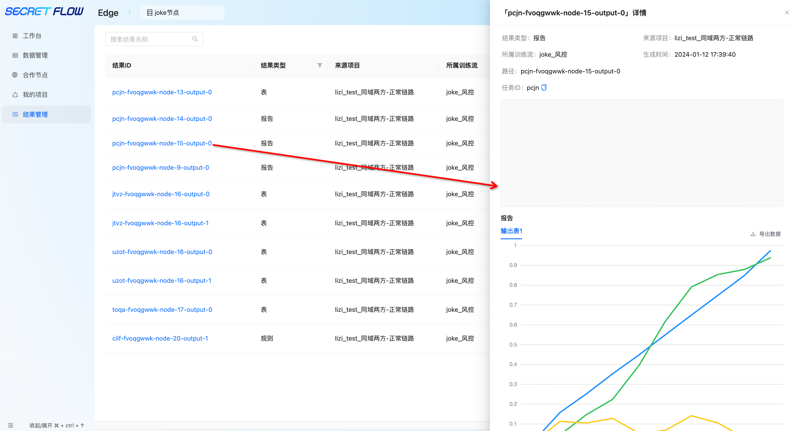

# 结果管理

## 1. 模块说明

本模块主要是查看并下载任务运行成功后产生的本方结果数据

## 2. 查看训练流生成结果

可在“结果管理”查看该节点下所有训练流生成的结果

通过搜索“结果ID”、“来源项目”、“所属训练流”查询具体结果，结果类型包含“表、报告、规则、模型”，可根据类型对结果进行筛选。

## 3. 下载训练流生成结果

点击“下载”按钮可下载训练结果到本地

 注：其中“表、规则、模型”类型的结果可直接下载；“报告”类型的结果可点击“结果ID”查看具体报告并导出报告的原始数据。

