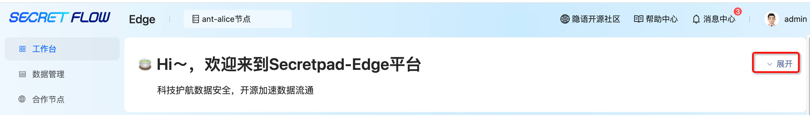
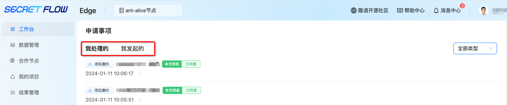
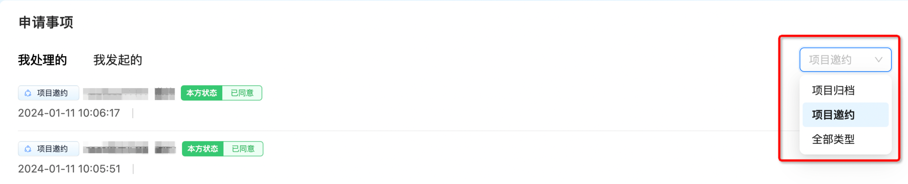
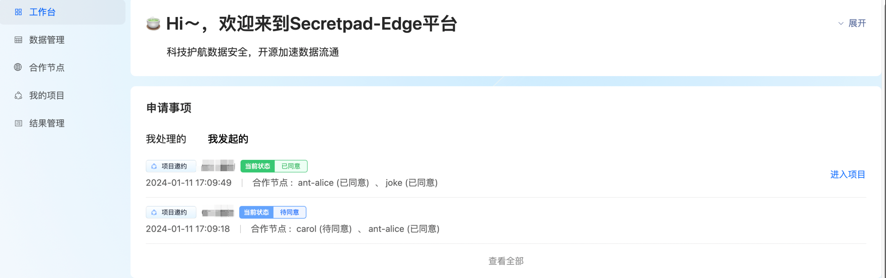
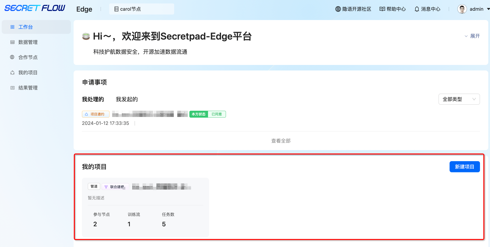

# 工作台

## 1. 模块说明

本模块主要是帮助用户快速了解平台使用流程、快速处理申请事项、查看或新建项目

## 2. 流程介绍

工作台—点击“展开”按钮，可查看SecretPad-Edge平台概念关系与任务流程图解，简洁明了帮助用户理解平台流程

## 3. 申请事项

工作台可查看平台的申请事项，包括主动发起和被动处理

“我处理的”事项，可根据不同事项类型进行筛选。

 注：绿色状态为本方已同意、蓝色状态为本方待同意，可选择同意或拒绝、红色状态为本方已拒绝。

“我发起的”事项，如所有合作节点都已同意项目邀约可直接进入项目，如任一合作节点尚未同意项目邀约此处不可进入项目。

 注：绿色状态为所有合作节点都已同意、蓝色状态为存在合作节点待同意，红色状态为存在任一合作节点已拒绝。

## 4. 我的项目

工作台可查看节点参与的所有项目，也可在此处新建项目

