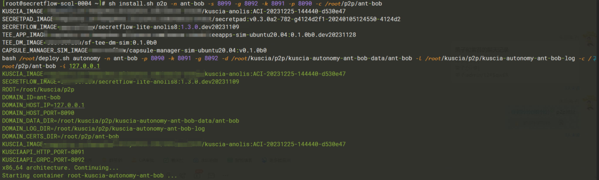
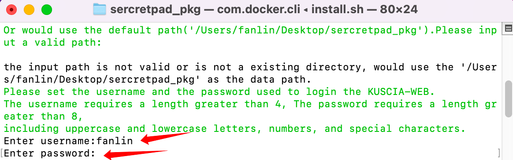

# 平台安装指引

# 1.安装指引

## 1.1. 系统要求

操作系统：CentOS7，CentOS8

资源：8core/16G Memory/200G Hard disk

## 1.2. Docker安装与配置

若已安装可跳过

### 1.2.1.Linux（CentOS）

```shell
# 安装 docker
yum install -y yum-utils
yum-config-manager \
  --add-repo \
  https://download.docker.com/linux/centos/docker-ce.repo
yum install -y docker-ce docker-ce-cli containerd.io

# 启动 docker。
systemctl start docker
```

其他 OS 可参考 Docker 官方文档：https://docs.docker.com/engine/install/（其他 OS 暂未进行系统性测试，若安装过程中出现问题，可提交
[Issue](https://github.com/secretflow/secretflow/issues) 反馈，欢迎开发者们提供相应解决方案）

### 1.2.2.Windows系统

参考[Docker官方文档](https://docs.docker.com/desktop/install/windows-install/)在 Windows 上安装 Docker，并确保 Docker
的后段是**WSL2**

MacOS 需将 docker container 内存上限提⾼为 6G。

参考[WSL官方文档](https://learn.microsoft.com/en-us/windows/wsl/wsl-config#configure-global-options-with-wslconfig)
设置对应的设置即可

### 1.2.3.mac OS

参考官网进行安装 https://docs.docker.com/desktop/install/mac-install/

### <font color=#DF2A3F> 非常重要📢 ： Docker 配置 </font>

**需将 docker container 内存上限提高为 6G，操作步骤如下（版本不同操作入口可能不同）：**

示例一（V4.3.1）：

 

示例二（V4.20.1）：


## 1.3. 隐语体验部署包安装（Linux）

### 1.3.1.解压部署包

下载部署包后解压

### 1.3.2.安装部署

通过 cd 命令进入解压后的部署包目录

输入sh install.sh p2p -n <节点名称> -s <secretpad p2p web端口号> -g <kuscia p2p 节点 API HTTP 端口> -k <kuscia p2p 节点
API GRPC 端口> -p <kuscia p2p 节点的gateway端口> -c <证书挂载路径>

<font color=#DF2A3F>PS：

①节点名称由用户自定义，最多 63 个字符，只能包含小写字母、数字，以及 '-'，且必须以字母或数字开头，必须以字母或数字结尾，默认节点名称就是节点ID；

②默认部署成功就是一个节点，如需安装新的节点，重复操作即可，注意一台电脑安装两个节点需保证两个节点名称/路径/端口均不同。 </font>

```shell
# 进入部署包所在路径
cd
# sh install.sh p2p -n ant-bob -s 8099 -g 8092 -k 8091 -p 8090 -c /root/p2p/ant-bob
sh install.sh p2p -n <节点名称> -s <secretpad p2p web端口号> -g <kuscia p2p 节点 API HTTP 端口> -k <kuscia p2p 节点 API GRPC 端口> -p <kuscia p2p 节点的gateway端口> -c <证书挂载路径>
```



### 1.3.3.设置登录web页面的用户名和密码

**用户名：** 长度要求大于4位字符；

**密码：** 长度要求大于8位字符，需包含大小写及特殊字符。



### 1.3.4.安装完成

看到“web server started successfully”即为部署成功


使用docker ps查看安装的容器

端口示例：
```test
容器:               端口对应:外部->内部  部署参数:
secretpad  http    port:  8088->8080  -s 参数
kuscia     http    port: 18080->1080  -k 参数
kuscia     grpc    port: 18082->8082  -g 参数
kuscia     gateway port: 18083->8083  -p 参数
```

[配置参数详情](../v0.6.0B0/deploy_secretpad.md#配置项详解)


### 1.3.5.浏览器访问平台

部署成功后，浏览器打开 http://localhost:secretpad 端口号（或者 http://部署服务器的ip:secretpad端口号），利用部署过程中配置的用户密码登录平台即可体验


若在部署过程中有相关的问题或者建议，可提交[Issue](https://github.com/secretflow/secretflow/issues)
反馈。