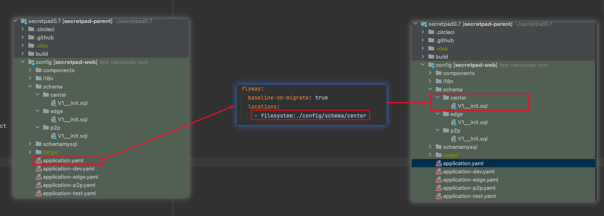
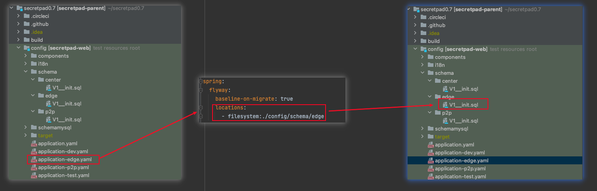
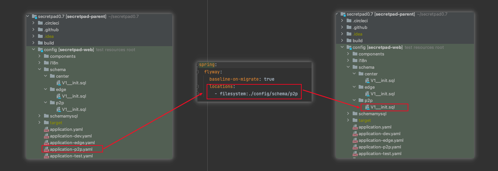

# 数据库版本管理

## 前言
SecretPad使用的数据库版本管理工具是Flyway，Flyway是一款数据库迁移（migration）工具。简单点说，就是在你部署应用的时候， 帮你执行数据库
脚本的工具。Flyway支持SQL和Java两种类型的脚本，你可以将脚本打包到应用程序中，在应用程序启动时，由Flyway来管理这些脚本的执行， 这些脚本被
Flyway称之为migration，具体有关Flyway的内容可参考
[Flyway官方文档](https://documentation.red-gate.com/flyway)

## sql 所在位置
sql 文件存放在`config/schema`目录下，文件名格式为`V1__init.sql`，其中`V1`表示版本号，`init`表示描述信息。

## 不同模式下所使用的 sql 文件

在每个模式的配置文件中定义所使用的 sql 具体路径，因此不同的模式使用的 sql 具体路径可以根据配置文件来查看。

### center 模式

### edge 模式

### p2p 模式

