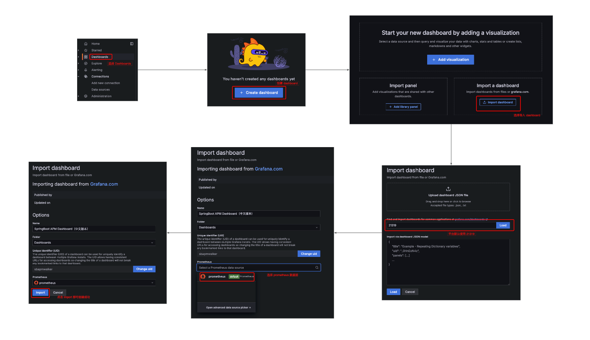
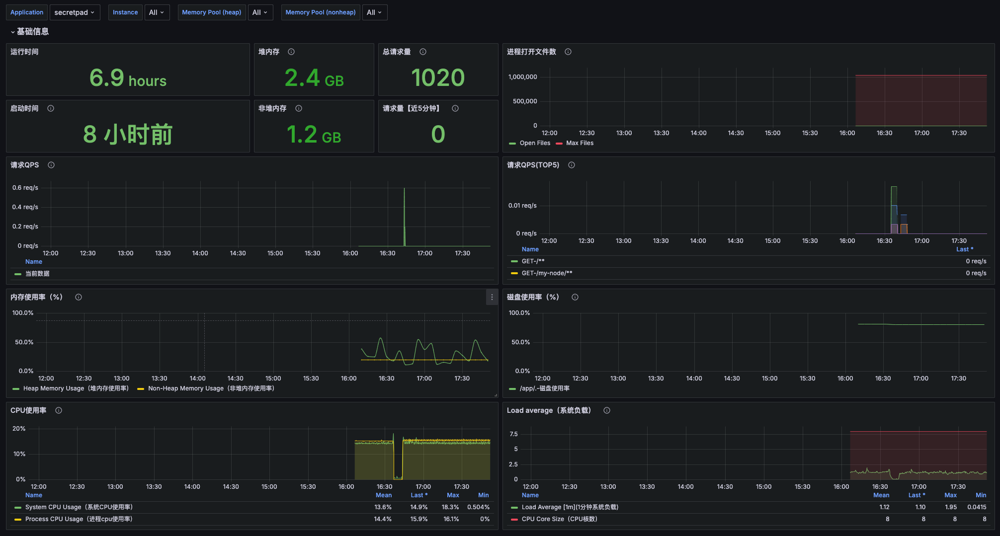

# prometheus使用文档

## 前提
需要启动 SecretPad 之后才能使用 Prometheus 监控

## 1.修改 prometheus.yml 文件

找到 prometheus.yml 文件，`文件位置：metrics/prometheus.yml`，修改 scrape_configs.static_configs.targets 配置为 SecretPad 的地址

## 2.启动 Prometheus

在 metrics 目录下执行 `sh start.sh` 启动 Prometheus，或者使用 idea 打开 start.sh 脚本，点击执行即启动 Prometheus

## 3.访问 Prometheus

打开 http://localhost:3000/ 即可访问，默认用户名密码为 admin/admin。

## 4.配置 datasource 数据源

## 5.导入 Dashboard

## 6.查看监控数据
