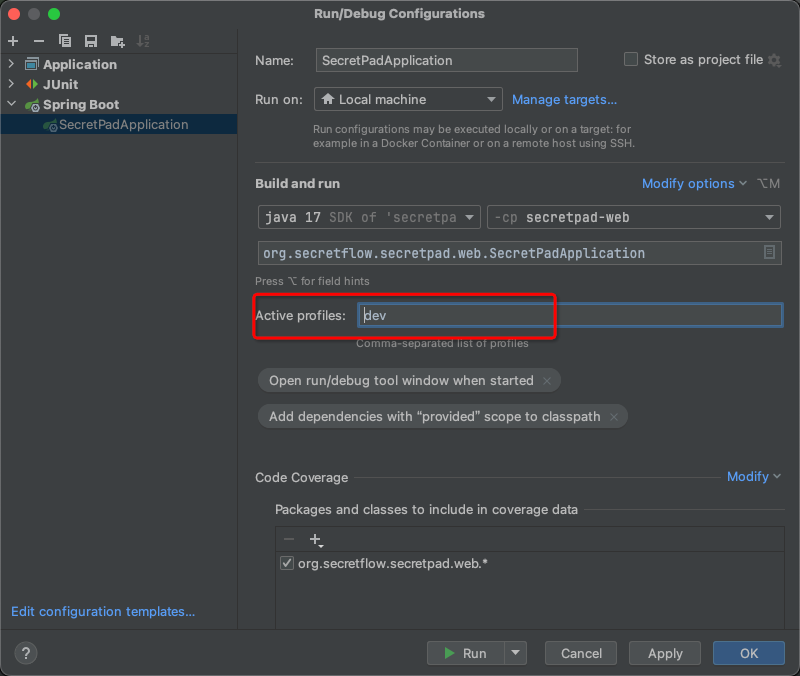
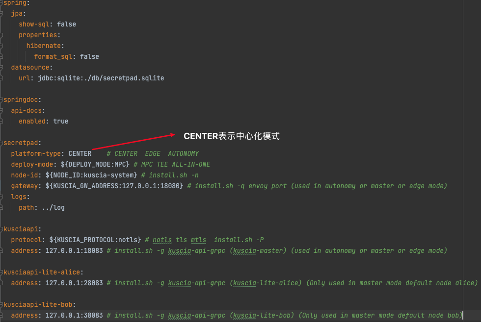
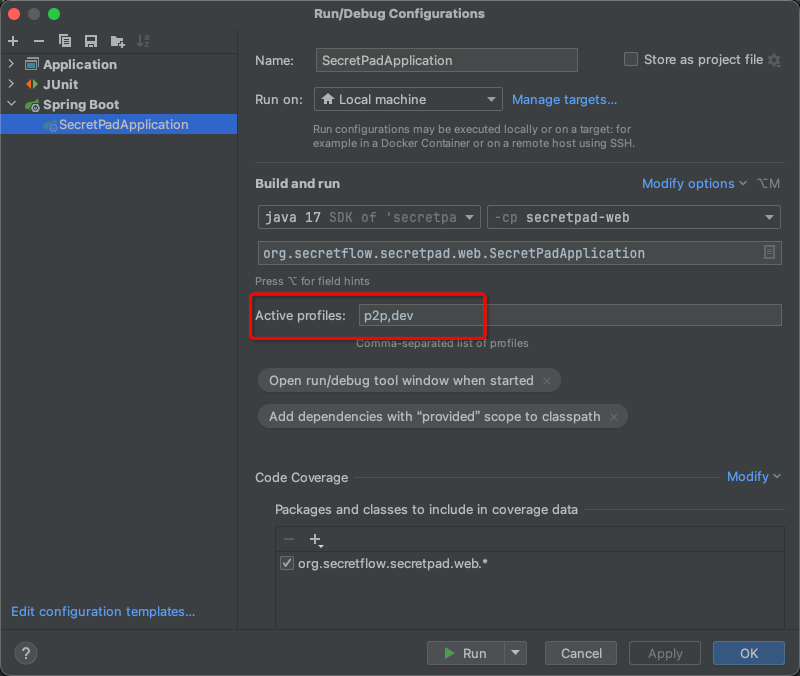
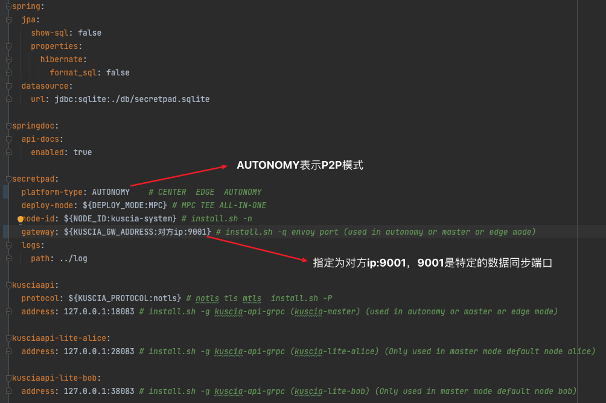
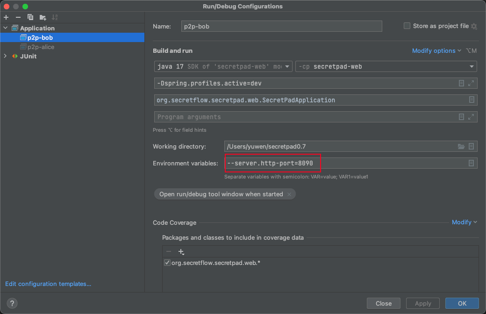

# SecretPad 本地调试（目前只针对 MAC）

## 环境准备

[环境准备](build_SecretPad_cn.md#开发环境搭建)
## 代码准备

### 后端 SecretPad (Java)

```text
https://github.com/secretflow/SecretPad
https://gitee.com/secretflow/SecretPad
```

## 代码编译

### 后端 SecretPad (Java)

> 在项目拉取完成后，打开开发工具（如：eclipse、idea）刷新maven。导入依赖。
> 项目中有自身构建依赖，需install到本地。
> 项目中有proto包需要进行编译，需compile到本地。

```shell
mvn clean install -Dmaven.test.skip=true
mvn compile
```

## 本地调试

### 后端 SecretPad (Java)

> 目前SecretPad本地调试需依赖Kuscia，简单利用mvp操作，步骤如下

#### Mvp 准备
>SecretPad 版本与 Kuscia 版本需要对应，具体可参考
[版本映射表](../../README.zh-CN.md#组件版本)

- linux/amd64 [secretflow-allinone-linux-x86_64-latest.tar.gz](https://secretflow-public.oss-cn-hangzhou.aliyuncs.com/mvp-packages/secretflow-allinone-linux-x86_64-latest.tar.gz)
- linux/arm64 [secretflow-allinone-linux-aarch_64-latest.tar.gz](https://secretflow-public.oss-cn-hangzhou.aliyuncs.com/mvp-packages/secretflow-allinone-linux-aarch_64-latest.tar.gz)


SecretPad 分为两种模式，中心化模式和 p2p 模式，因此本地调试也分两种模式进行调试。


### 中心化模式

#### 安装 MVP

下载后得到 tar 压缩包为：secretflow-allinone-package-latest.tar.gz

---

```shell
 tar -zxvf secretflow-allinone-package-latest.tar.gz
 cd secretflow-allinone-package-latest
 bash install.sh master -P notls
```

-P的含义具体可以查看：部署文档：[SecretPad部署文档](../deployment/guide.md#installsh参数详解)


> **安装结束后出现如下内容则为安装完成 妥善保存用户名密码和安装路径：**

:::success
web server started successfully
Please visit the website [http://localhost:8088](http://localhost:8088) (or http://{the IPAddress of this machine}:8088)
to experience the Kuscia web's functions .
The login name:'admin' ,The login password:'12#$qwER' . （用户名+密码）
The demo data would be stored in the path: /Users/lucky/Kuscia
:::

---

#### SecretPad 本地启动准备-stop mvp 中的进程

> 查看进程

```shell
 docker ps
 ----------------------
 CONTAINER ID   IMAGE                                                                                                            COMMAND                   CREATED              STATUS              PORTS                                                                       NAMES
c406f88100b4   secretflow-registry.cn-hangzhou.cr.aliyuncs.com/secretflow/SecretPad:v0.2.0b0-6-g4eae988-20230911104908-4eae98   "java -jar -Dsun.net…"   About a minute ago   Up About a minute   80/tcp, 0.0.0.0:8088->8080/tcp                                              lucky-Kuscia-SecretPad
6da080bc5afd   secretflow-registry.cn-hangzhou.cr.aliyuncs.com/secretflow/Kuscia:0.3.0b0                                        "bin/entrypoint.sh t…"   5 minutes ago        Up 5 minutes        0.0.0.0:38080->1080/tcp                                                     lucky-Kuscia-lite-bob
f2e458ffc357   secretflow-registry.cn-hangzhou.cr.aliyuncs.com/secretflow/Kuscia:0.3.0b0                                        "bin/entrypoint.sh t…"   6 minutes ago        Up 6 minutes        0.0.0.0:28080->1080/tcp                                                     lucky-Kuscia-lite-alice
2baf8096ed5a   secretflow-registry.cn-hangzhou.cr.aliyuncs.com/secretflow/Kuscia:0.3.0b0                                        "tini -- scripts/dep…"   7 minutes ago        Up 7 minutes        0.0.0.0:18080->1080/tcp, 0.0.0.0:18082->8082/tcp, 0.0.0.0:18083->8083/tcp   lucky-Kuscia-master
```

---

> **结束 SecretPad 进程**
> **找到 SecretPad 名 NAMES 为 lucky-Kuscia-SecretPad （不同安装的 name 不同）**

```shell
docker stop lucky-Kuscia-SecretPad
```

#### SecretPad 本地启动准备-配置启动参数

> 参数说明：spring.profiles.active 为项目命名空间



---

#### 修改 config/application-dev.yaml

>主要修改 SecretPad.platform 为 CENTER，其他参数修改可根据注释修改。




#### 中心化模式 SecretPad 本地启动

```text
SecretPadApplication
```

#### 测试是否成功启动

> 项目成功启动后；可打开链接测试：[http://localhost:8080/login](http://localhost:8080/login) （端口可能不同，根据启动情况）

### P2P 模式

#### 安装 MVP

下载后得到tar压缩包为：secretflow-allinone-package-latest.tar.gz

---

```shell
 tar -zxvf secretflow-allinone-package-latest.tar.gz
 cd secretflow-allinone-package-latest
 bash install.sh autonomy -P notls
```

-P的含义具体可以查看：部署文档：[SecretPad部署文档](../deployment/guide.md#installsh参数详解)


> **安装结束后出现如下内容则为安装完成 妥善保存用户名密码和安装路径：**

:::success
web server started successfully
Please visit the website [http://localhost:8088](http://localhost:8088) (or http://{the IPAddress of this machine}:8088)
to experience the Kuscia web's functions .
The login name:'admin' ,The login password:'12#$qwER' . （用户名+密码）
The demo data would be stored in the path: /Users/lucky/Kuscia
:::

---

#### SecretPad 本地启动准备-stop mvp 中的进程

> 查看进程

```shell
 docker ps
 ----------------------
 CONTAINER ID   IMAGE                                                                                                            COMMAND                   CREATED              STATUS              PORTS                                                                       NAMES
c406f88100b4   secretflow-registry.cn-hangzhou.cr.aliyuncs.com/secretflow/SecretPad:v0.2.0b0-6-g4eae988-20230911104908-4eae98   "java -jar -Dsun.net…"   About a minute ago   Up About a minute   80/tcp, 0.0.0.0:8088->8080/tcp                                              lucky-Kuscia-SecretPad-lucky
2baf8096ed5a   secretflow-registry.cn-hangzhou.cr.aliyuncs.com/secretflow/Kuscia:0.3.0b0                                        "tini -- scripts/dep…"   7 minutes ago        Up 7 minutes        0.0.0.0:18080->1080/tcp, 0.0.0.0:18082->8082/tcp, 0.0.0.0:18083->8083/tcp   lucky-Kuscia-autonomy-lucky
```

---

> **结束 SecretPad 进程**
> **找到 SecretPad 名 NAMES 为 lucky-Kuscia-SecretPad （不同安装的 name 不同）**

```shell
docker stop lucky-Kuscia-SecretPad
```

#### SecretPad 本地启动准备-配置启动参数

> 参数说明：spring.profiles.active为项目命名空间



---

#### 修改 config/application-dev.yaml

>主要修改SecretPad.platform为AUTONOMY，SecretPad.gateway为对方ip:9001，其他参数修改可根据注释修改。



#### 启动两个实例

>p2p 模式需要运行两个节点，因此需要启动两个实例，在本地调试中，可复制一个相同的实例并修改一下端口即可。
>


#### p2p 模式 SecretPad 本地启动

```text
p2p-alice
p2p-bob
```

#### 测试是否成功启动

> 项目成功启动后；可打开链接测试：[http://localhost:8080/login](http://localhost:8080/login) （端口可能不同，根据启动情况）
> 项目成功启动后；可打开链接测试：[http://localhost:8090/login](http://localhost:8090/login) （端口可能不同，根据启动情况）
