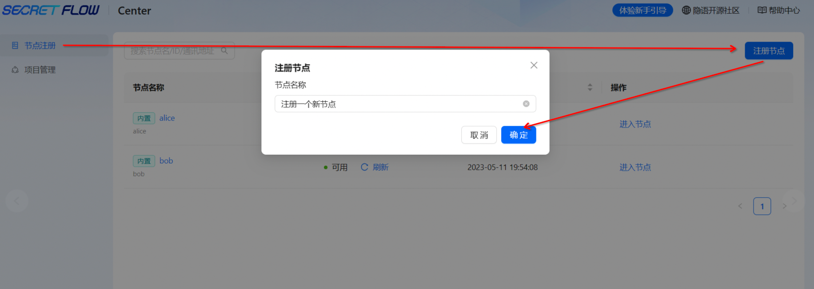
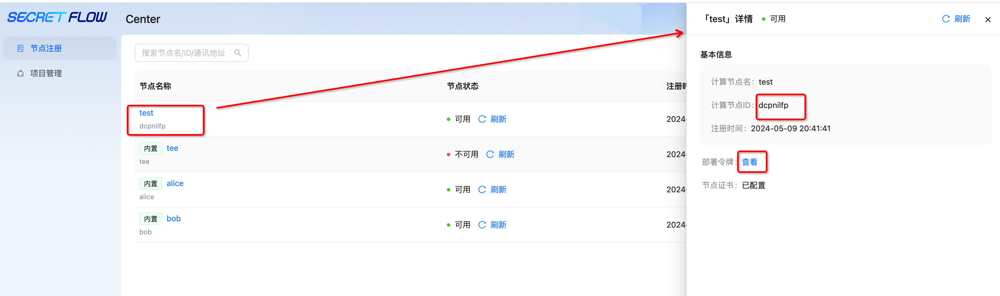
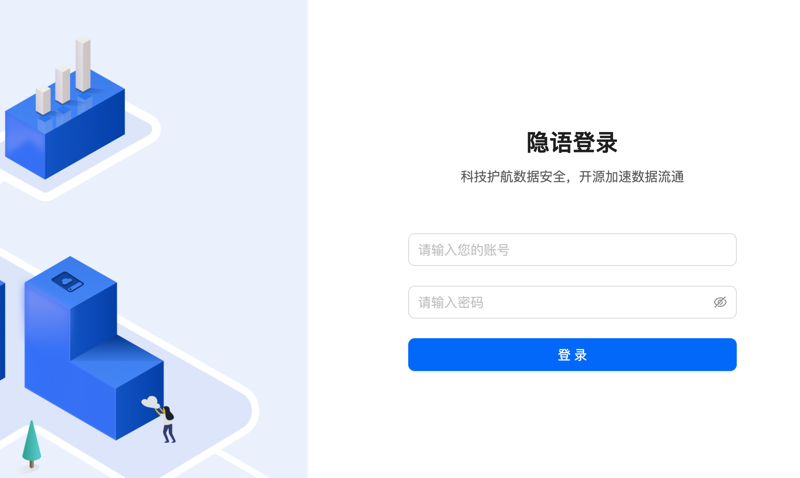
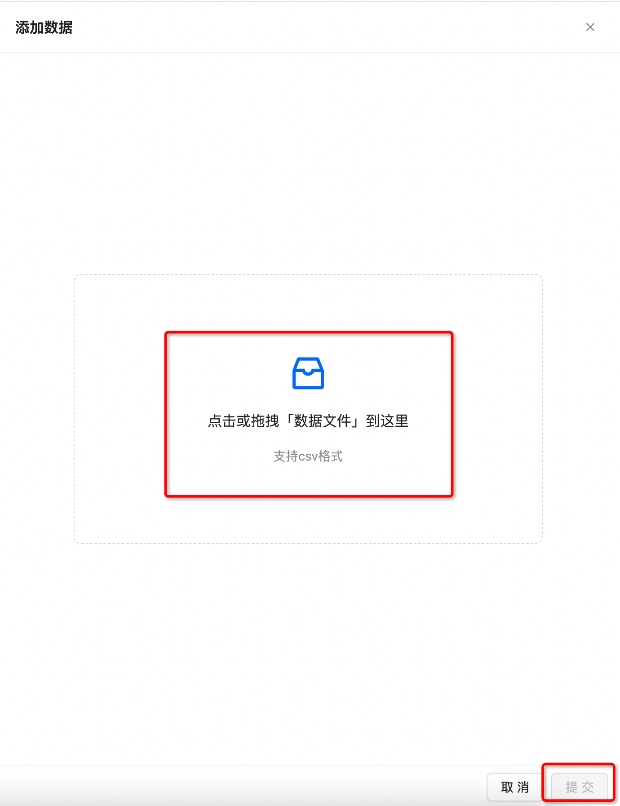
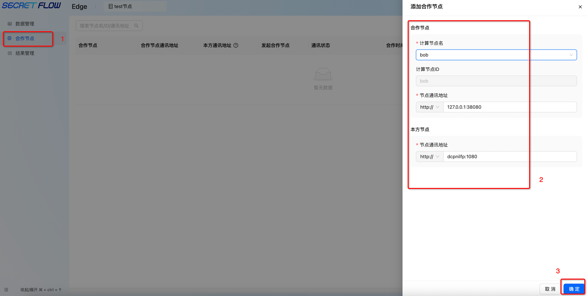
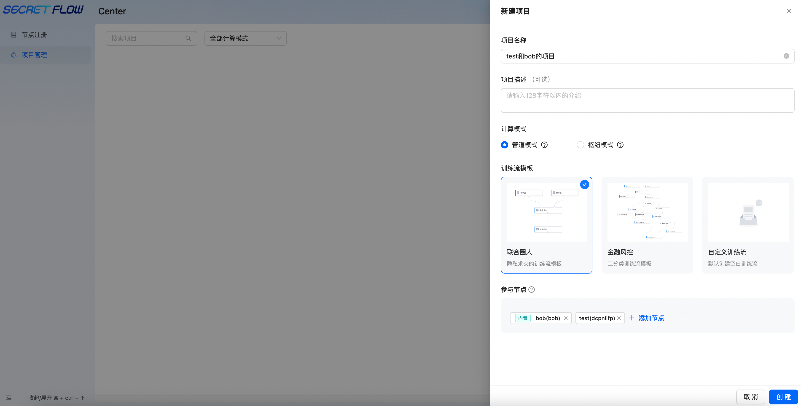

# 中心化 Edge 节点
在体验之前确保你已经成功部署中心化模式。
## 注册节点

在中心节点上注册一个新节点，注册节点后，节点将被分配一个唯一的 ID，该 ID 用于标识节点。



点击**节点名称**获取：**节点 ID**、**节点部署令牌**。


## 部署 Edge 节点

执行 install.sh 脚本，完成 Edge 节点的部署。
``` shell
sh install.sh lite -n <节点ID> -t <节点部署令牌> -p 30002 -m 'http://<Master的IP:端口号>' -s 8085 -k 40812 -g 40813 -q 14801 -P notls
```

部署成功后访问 http://localhost:8085（端口号由 -s 参数指定）。

如果在部署的时候没有自行设置账号及密码，系统会提供默认的账号名 **admin** 以及随机生成的密码。




如果用户忘记了账号或密码，可以执行以下命令，查看当前运行的容器：

```shell
 docker ps
```

找到 SecretPad 的容器 ID，然后执行：

```shell
 docker logs <CONTAINER ID>
```

即可查看账号及密码。

## 添加数据

项目创建成功之后，在**数据管理**界面添加数据。


## 建立连接

在**合作节点**中添加合作节点，这里以添加 bob 节点（Center 模式内置节点）为例。

点击添加合作节点——选择已注册的可用节点——输入合作节点的通讯地址——输入本节点对合作节点暴露的通讯地址——点击**确定**即可建立合作关系。




Tips：节点通讯地址协议是根据平台安装时「-P 参数（默认为 TLS）」自动生成，NOTLS 对应 http，TLS 和 MTLS 对应 https。
若需要查询节点端口号，则输入如下命令：

```  shell
 # 查询本节点端口号的命令
 docker ps
```

## 创建项目

test 节点与 bob 节点成功建立连接之后，在 Center 平台中创建项目，参与节点选择 test 与 bob。



为数据添加授权项目、创建训练流、日志查看以及结果查看与导出等过程可参考[ Center 模式](./master.md)。
