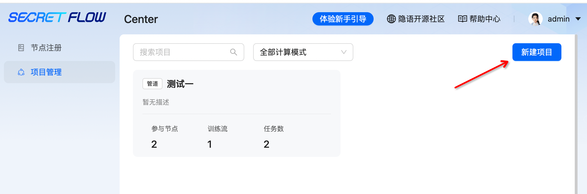
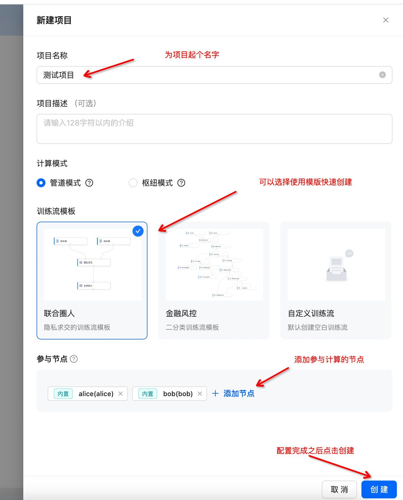
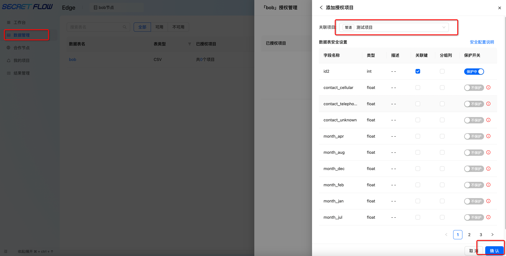
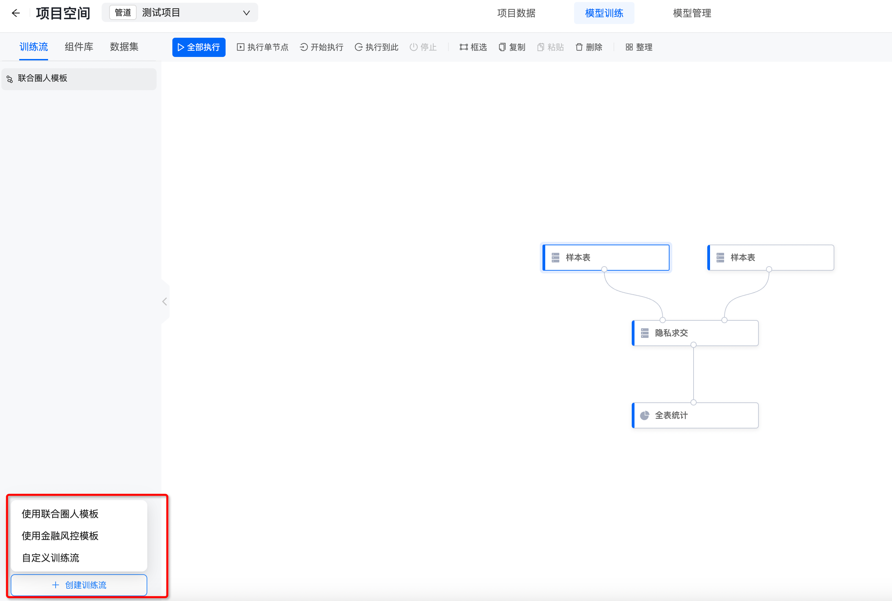
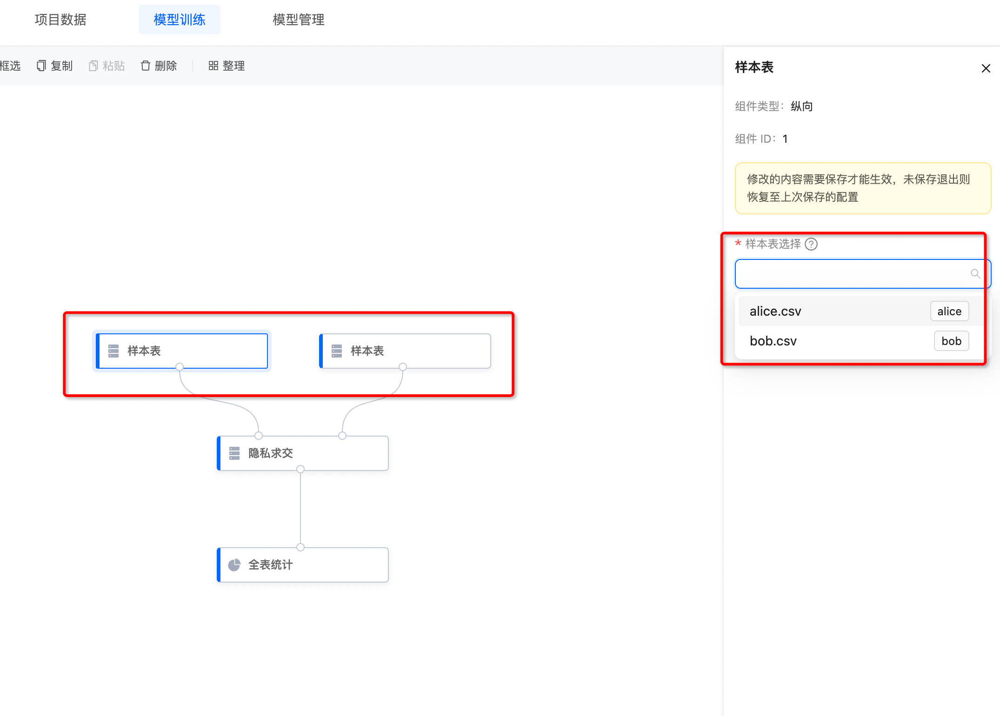
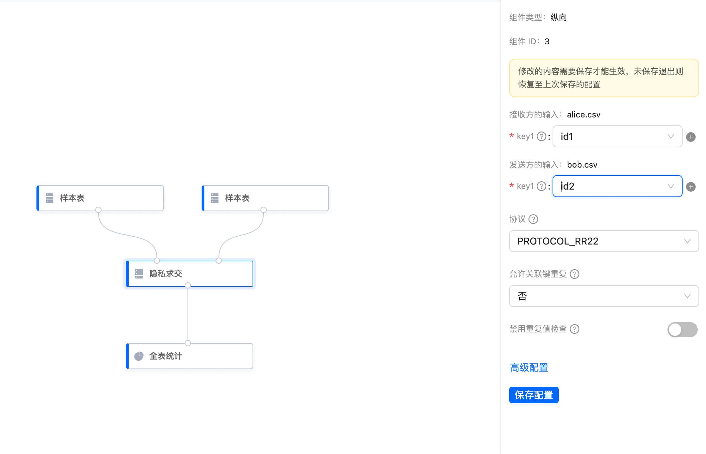
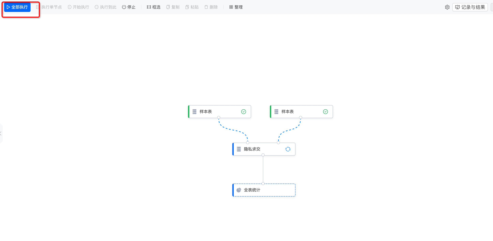
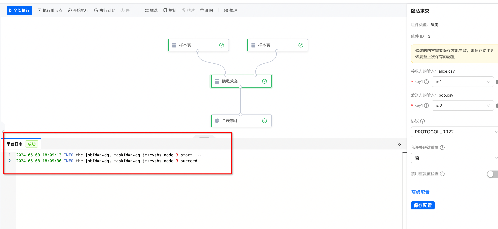
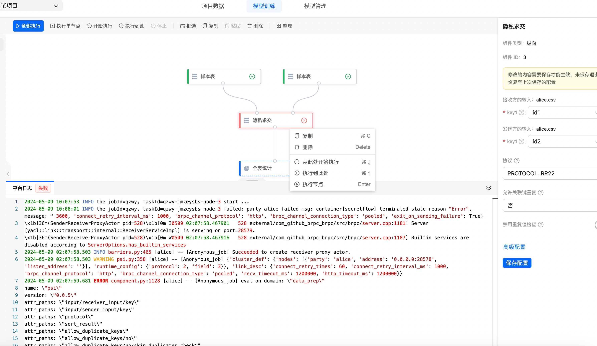
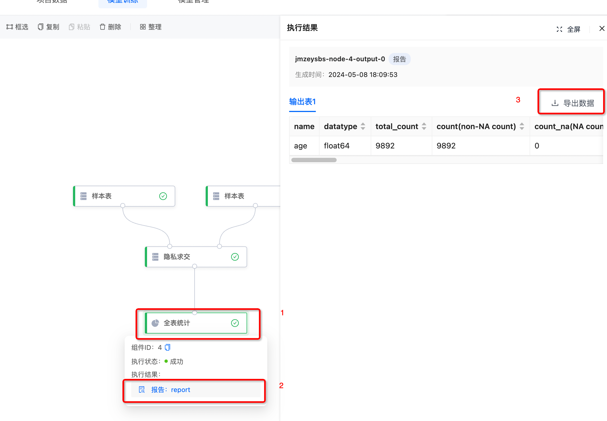

# 中心化 Center 节点
在体验之前确保你已经成功部署中心化模式。
## 登录
如果在部署的时候没有自行设置账号及密码，系统会提供默认的账号名 **admin** 以及随机生成的密码。


如果用户忘记了账号或密码，可以执行以下命令，查看当前运行的容器：

```shell
 docker ps
```

找到 SecretPad 的容器 ID ，然后执行：

```shell
 docker logs <CONTAINER ID>
```

即可查看账号及密码。


## 创建项目
成功登录之后点击**新建项目**来创建项目。



接下来进行项目配置。



项目创建成功之后，在**数据管理**界面添加数据，并为数据添加授权项目。



## 创建训练流

项目创建完成之后，创建训练流，可以使用模板，也可以自定义创建训练流，这里以**联合圈人模板**训练流为例。


**联合圈人模板**训练流包含以下组件，你可以逐个点击它们进行配置，先从样本表开始，为两个**样本表**组件分别选择不同的数据。



配置其它组件。


配置完成之后点击**全部执行**按钮，等待训练流执行完毕。


### 日志查看
点击组件可以查看其日志。



如果由于一些原因导致训练出错，比如样本表使用同一张表，你可以查看错误日志。


如果你需要查看更详细的日志，可以运行命令

```shell
cd kuscia/master/secretpad/kuscia-system/log/
```
进入到该目录下，查看你需要的日志，比如使用以下命令查看：

```shell
tail -3000 secretpad.log
```


## 查看结果
训练流运行完毕可以查看并导出结果。

