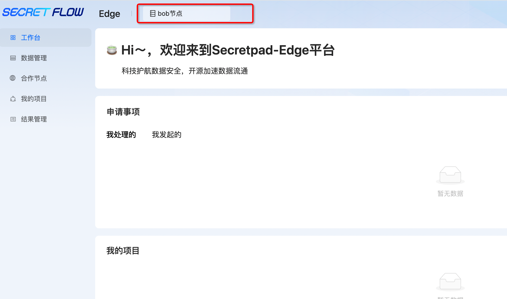
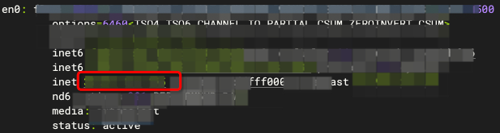
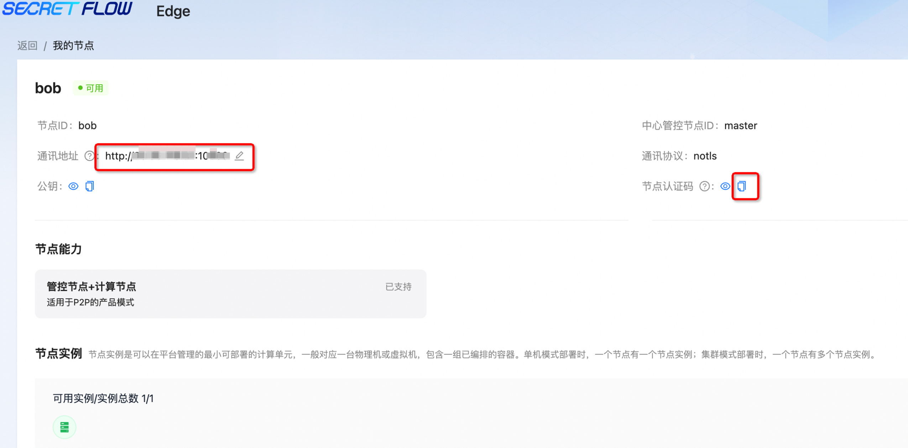
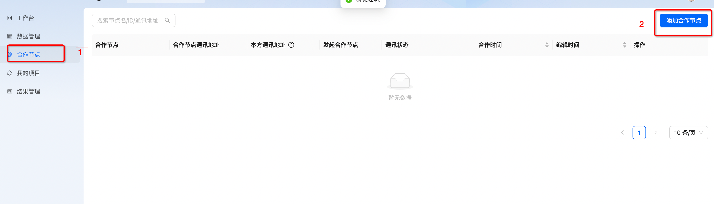
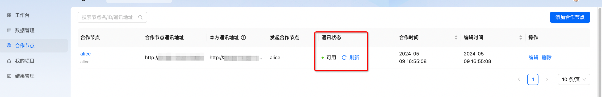
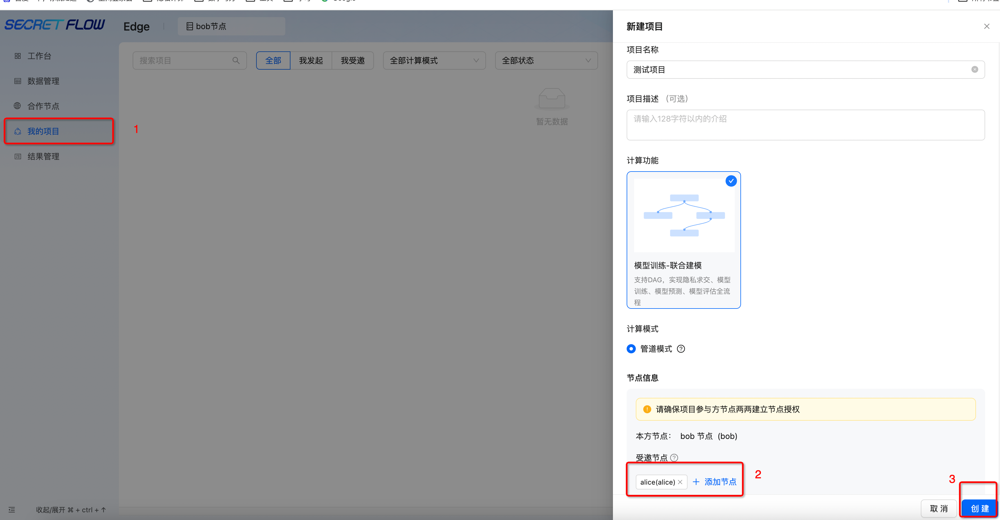
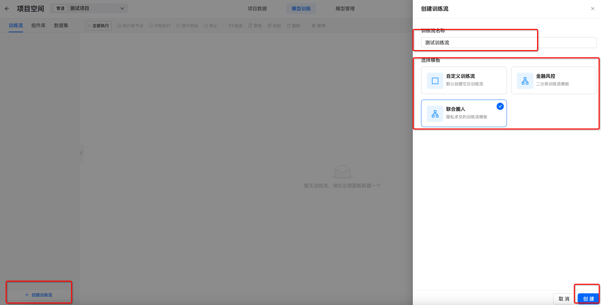
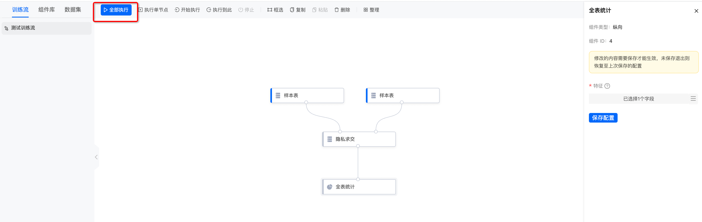
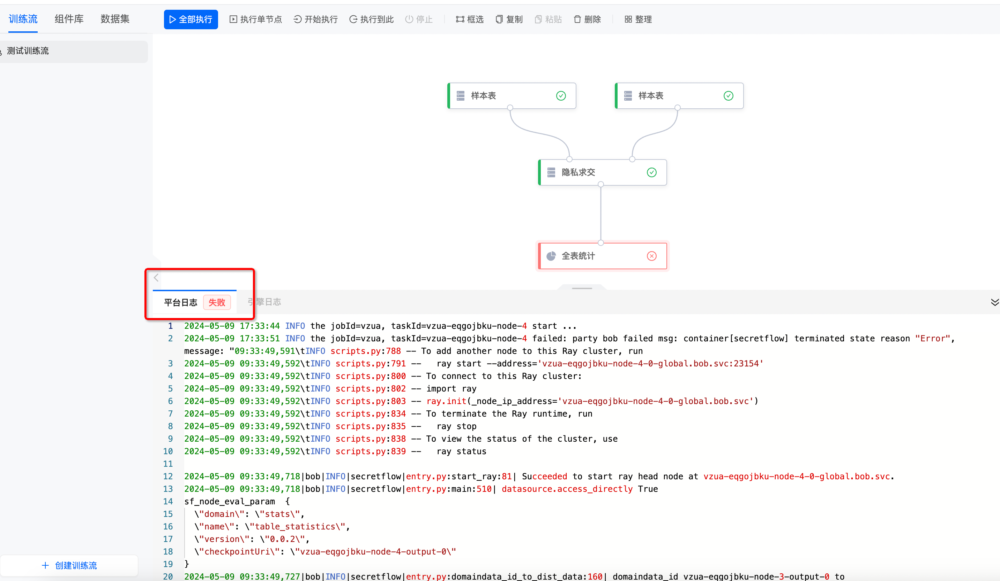
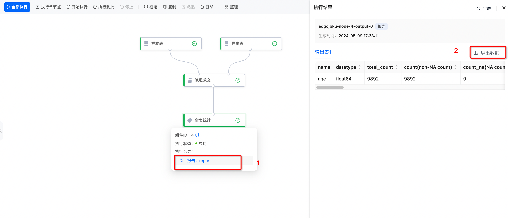

# P2P 节点
在体验之前确保你已经成功部署 P2P 模式。
## 登录
如果在部署的时候没有自行设置账号及密码，系统会提供默认的账号名 **admin** 以及随机生成的密码。


如果用户忘记了账号或密码，可以执行以下命令，查看当前运行的容器：

```shell
 docker ps
```

找到 SecretPad 的容器 ID，然后执行：

```shell
 docker logs <CONTAINER ID>
```

即可查看账号及密码。

## 建立连接
这里以 bob 节点为例，合作方节点（alice）操作同理。

登录成功之后，点击 **bob节点**。


填写正确的**IP地址**及**端口号**，你可以在终端输入`ifconfig`查看本机 IP 地址。



然后复制**节点认证码**，并将该认证码发送给合作方节点（alice）。

同样也需要拿到合作方节点（alice）的节点认证码。



点击**添加合作节点**按钮，输入合作方节点（alice）的节点认证码，识别解析并添加合作节点，合作方节点（alice）操作同理。



通讯状态为**可用**即为连接成功！



## 新建项目
节点之间建立起连接之后，进行创建项目，将合作节点添加进来。

等待合作方节点同意项目创建请求。



项目创建成功之后，在**数据管理**界面添加数据，并为数据添加授权项目。


进入创建好的项目，点击**创建训练流**，可以使用模版快速创建训练流，也可以自定义创建。


配置训练流中各个组件，配置完成后点击**全部执行**，开始训练。


点击组件可以查看运行日志。


如果你需要查看更详细的日志，可以运行命令

```shell
cd kuscia/autonomy/secretpad/<节点名称>/log/
```
进入到该目录下，查看你需要的日志，比如使用以下命令查看：

```shell
tail -3000 secretpad.log
```

## 查看结果

训练流运行完毕可以查看并导出结果。
